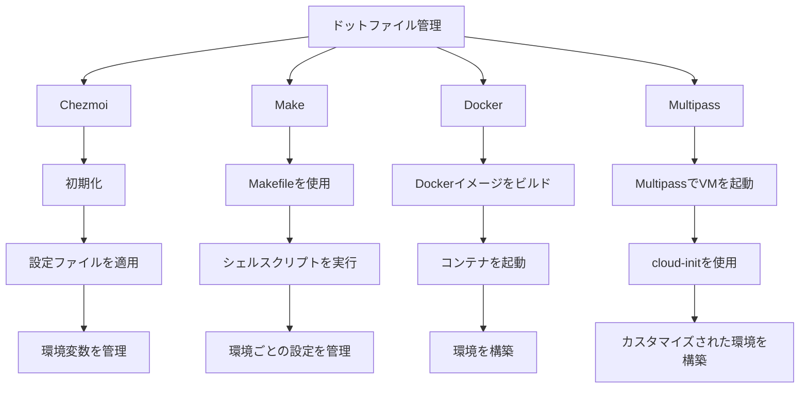
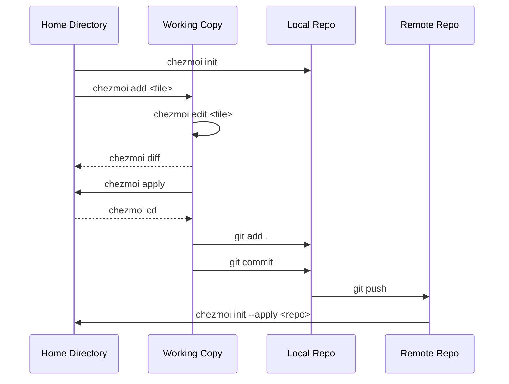

<!-- <link href="./style.css" rel="stylesheet"></link> -->

# dotfiles

## 🍍🍕 0.4.1

### 🏴‍☠ [budybye/dotfiles](https://github.com/budybye/dotfiles)

- このリポジトリは、私、個人の設定ファイルを管理するためのものです。
- `chezmoi` で管理しています。
- さまざまなツールや設定ファイルを統合、管理、改善して、効率的に設定された環境を構築することを目的としています。
- `MacOS` と `Ubuntu` の設定ファイルを管理しています。
- `xrdp` 接続できる `Docker` や `Multipass` でも環境設定しています。
- `Windows` や `WSL2` の設定ファイルも追加予定...
- `.github/workflows/*.yaml` で環境ごとのテスト、タグ設定、ghcrへpush を行っています。
- `~/.ssh/*` やシークレットな情報は `.env` `age` `Bitwarden` `chezmoi` で管理しています。
- `Dockerfile` と `docker-compose.yaml` と `devcontainer.json` で `Docker` コンテナを管理しています。
- `Github`, `VSCode`, `Cursor` の設定も管理しています。
- Font, Theme, Wallpaper, 日本語版設定 も管理しています。
- `Brave`, `Cursor`, `Tabby`, `Xfce4` などデスクトップ環境も管理しています。
- プログラミング言語開発環境は `mise` で管理しています。

### 初期設定

- `curl` `git` `make` が必要です。

```sh
curl -fsLS https://chezmoi.io/get | sh -s -- -b ${HOME}/.local/bin init --apply budybye
# or
sh -c "$(curl -fsLS https://chezmoi.io/get)" -- -b ${HOME}/.local/bin init --apply budybye
```

~/dotfiles に配置する場合

```sh
cd ~
git clone git@github.com:budybye/dotfiles.git
cd dotfiles
make init
```

`chezmoi apply` で `run_*` スクリプトが実行されます。
`install` スクリプトを実行することもできます。

```sh
sh -c ~/dotfiles/install
```

### git グローバル設定

```sh
# ~/.config/git/user.conf を分けて設定している
cat <<EOF >~/.config/git/user.conf
[user]
    name = {{ .name }}
    email = {{ .email }}
EOF

# or
git config --global user.name {{ .name }}
git config --global user.email {{ .email }}
# コミットメッセージのテンプレート
git config --global commit.template ~/.config/git/commit_template
# ~/.config/git/config の設定の確認
git config --list
```

---

## 概要

- **Chezmoi**: `chezmoi` でドットファイルを管理しています。
- **対応OS**: `MacOS` Sequoia、`Ubuntu` 24.04 `chezmoi tmplate` でOSごとの設定を管理しています。
- **テスト**: `GitHub Actions` を使用して、さまざまなOSでの動作を確認しています。
- **Makefile**: `Makefile` で設定管理しています。
- **今後の計画**: `arm64` 互換と `WSL2` と `Windows` 用の設定ファイルを追加で管理する予定です。
- **Docker**: `Dockerfile` と `docker-compose.yaml` と `devcontainer.json` で `Docker` コンテナを管理しています。

## 目次

1. [XDG ディレクトリ構成](#XDG-Base-Directory)
2. [管理方法](#管理方法)
3. [Chezmoi](#Chezmoi)
4. [Makefile](#Makefile)
5. [Github Actions](#Github-Actions)
6. [Mise](#Mise)
7. [環境変数](#環境変数)
9. [Docker](#Docker)
10. [Multipass](#Multipass)
11. [参考文献](#参考文献)

---

## XDG Base Directory

### [XDG Base Directory Specification](https://specifications.freedesktop.org/basedir-spec/basedir-spec-latest.html)

- XDG Base Directory Specification に基づくディレクトリの設定を行います。
- **XDG_CONFIG_HOME**: ユーザー固有の設定ファイルの格納先。
- **XDG_DATA_HOME**: ユーザー固有のデータファイルの格納先。
- **XDG_CACHE_HOME**: ユーザー固有のキャッシュファイルの格納先。
- **XDG_STATE_HOME**: ユーザー固有の状態ファイルの格納先。
- **XDG_DATA_DIRS**: システム全体のデータファイルの検索パス。
- **XDG_CONFIG_DIRS**: システム全体の設定ファイルの検索パス。
- 環境変数で設定できますが、なるべくデフォルトを使用します。
- 特に `~/.config` は様々なツールに使用されているので、なるべく採用します。

```:tree
 .
├──  .devcontainer
│   ├──  ipfs
│   ├──  portainer
│   ├──  .env
│   ├──  .gitignore
│   ├──  devcontainer.json
│   ├──  docker-compose.yaml
│   ├──  Dockerfile
│   └──  entrypoint.sh
├──  .github
│   ├──  workflows
│   │   ├──  ipfs.yaml
│   │   ├──  push.yaml
│   │   ├──  tag.yaml
│   │   └──  test.yaml
│   └──  release.yml
├──  .vscode
│   └──  extensions.json
├──  cloud-init
│   ├──  lxd.yaml
│   ├──  multipass.yaml
│   ├──  network-config
│   └──  user-data
├──  home
│   ├──  .chezmoidata
│   │   └──  packages.yaml
│   ├──  .chezmoiscripts
│   │   ├──  darwin
│   │   ├──  linux
│   │   ├──  run_after_check.sh.tmpl
│   │   ├──  run_after_once_youtube.sh.tmpl
│   │   ├──  run_after_xrp.sh
│   │   ├──  run_once_before_age_decrypt.sh.tmpl
│   │   ├──  run_once_before_bw_unlock.sh.tmpl
│   │   ├──  run_once_ssh_keygen.sh.tmpl
│   │   ├──  run_onchange_activate.sh.tmpl
│   │   └──  run_onchange_vscode.sh.tmpl
│   ├──  dot_ssh
│   │   ├──  authorized_keys.tmpl
│   │   ├──  config.tmpl
│   │   ├──  encrypted_private_id_ed25519.age
│   │   ├──  encrypted_private_id_rsa.age
│   │   └──  id_ed25519.pub.tmpl
│   ├──  private_dot_config
│   │   ├──  act
│   │   ├──  alacritty
│   │   ├──  aquaproj-aqua
│   │   ├──  bat
│   │   ├──  byobu
│   │   ├──  Code
│   │   ├──  element
│   │   ├──  fcitx5
│   │   ├──  fish
│   │   ├──  fusuma
│   │   ├──  gh
│   │   ├──  git
│   │   ├──  ipfs
│   │   ├──  karabiner
│   │   ├──  lsd
│   │   ├──  mise
│   │   ├──  mpd
│   │   ├──  ncmpcpp
│   │   ├──  neofetch
│   │   ├──  nvim
│   │   ├──  ripgrep
│   │   ├──  sheldon
│   │   ├──  tabby
│   │   ├──  tmux
│   │   ├──  vim
│   │   ├──  wireshark
│   │   ├──  Brewfile
│   │   ├──  dot_editorconfig
│   │   └──  starship.toml
│   ├──  .chezmoi.toml.tmpl
│   ├──  .chezmoiexternal.toml.tmpl
│   ├──  .chezmoiignore
│   ├──  .env
│   ├──  dot_aliases
│   ├──  dot_bash_profile
│   ├──  dot_bashrc
│   ├──  dot_profile
│   ├──  dot_zlogin
│   ├──  dot_zprofile
│   ├──  dot_zshenv
│   ├──  dot_zshrc
│   ├──  key.txt.age
│   └──  shhh.txt
├──  .chezmoiroot
├──  .cursorrules
├──  .mise.toml
├──  .tool-versions
├──  install.sh
├──  Makefile
├──  README.md
├──  style.css
└──  etc...
```

- **シェル設定**: ログインシェルやインタラクティブシェルで読み込まれるファイル。
- **Makefile**: `Makefile` で シェルスクリプトを設定管理。
- **.local/bin**: 初期設定用などのシェルスクリプトを格納するディレクトリ。
- **.devcontainer**: `docker` と `devcontainer` 使用する設定ファイル。
- **.github**: `Github Actions` の設定ファイル。OS 差異のテスト用やイメージビルド用。
- **~/.config**: 様々なツールやアプリケーションの設定を管理するためのファイル。
- **.local/share**: ユーザーがインストールしたフォントや壁紙などの共有リソースを格納するディレクトリ。

---

## 管理方法

### 1. Chezmoiの活用

- [x] **クロスプラットフォーム対応**: macOS、Linux、Windows間でドットファイルを同期
- [x] **セキュリティ**: シークレットファイルを暗号化して管理
- [x] **テンプレート機能**: 環境ごとの設定を柔軟にカスタマイズ

### 2. Makeとの併用

- [x] **特定の設定やスクリプトの自動化**: Makefileを使用
- [x] **Chezmoiとの連携**: ドットファイルの管理はChezmoiに任せる

### 3. .devcontainerとの統合

- [x] **Dev Containers内でChezmoiを使用**: コンテナ起動時に自動的にドットファイルを適用

### 4. Github Actions でテスト





### Script

| Chezmoi Script | MacOS | Ubuntu |
|----------------|:-------:|:--------:|
| run_once_before_age.sh.tmpl | ✅ | ✅ |
| run_once_before_bw.sh.tmpl | ✅ | ✅ |
| run_after_activate.sh.tmpl | ✅ | ✅ |
| run_onchange_after_bootstrap.sh.tmpl | ✅ | |
| run_onchange_after_defaults.sh.tmpl | ✅ | |
| run_onchange_after_cli.sh.tmpl | | ✅ |
| run_once_after_docker.sh.tmpl | | ✅ |
| run_onchange_after_gui.sh.tmpl | | ✅ |
| run_once_after_setup.sh.tmpl | | ✅ |
| run_onchange_after_snap.sh.tmpl | | ✅ |
| run_once_after_ssh.sh.tmpl | ✅ | ✅ |
| run_onchange_after_vscode.sh.tmpl | ✅ | ✅ |
| run_onchange_after_with.sh.tmpl | ✅ | ✅ |
| run_onchange_after_xrp.sh.tmpl | ✅ | ✅ |
| run_once_after_youtube.sh.tmpl | ✅ | ✅ |

### Script rule

- `.tmpl` は `chezmoi apply` でテンプレートとして認識されます。
- `run_` は `chezmoi apply` で名前順に実行されます。
- `once_` は `chezmoi apply` 一度だけ実行されます。
- `onchange_` は 前回の `chezmoi apply` から変更があった場合に実行されます。
- `before_` は `chezmoi apply` 前に実行されます。
- `after_` は `chezmoi apply` 後に実行されます。
- それぞれのscriptは `after_` `before_` `onchange_` `once_` `run_` `.tmpl` などのchezmoi構文を除いた名前になります。

### chezmoiignore

- `chezmoiignore` で `chezmoi apply` で除外するファイルを管理できます。
- 除外されたファイルは `chezmoi ignored` で確認できます。

```txt:.chezmoiignore
# templateを使用できます

{{ if ne .chezmoi.os "linux" }}
.config/fcitx5
.config/fusuma
.local/share/fonts
.local/share/icons
.local/share/themes
.chezmoiscripts/linux/**
{{ end }}

.chezmoiexternal.*
key.txt.age
shhh.txt
```

### ツールのインストール

---

| *OS* | MacOS | Ubuntu | Docker  |
| --- | :---: | :---: | :---: |
| Chezmoi | brew | curl/mise | curl/mise |
| Make | brew | apt | apt |
| ZSH | brew | apt | apt |
| Git | brew | apt | apt |
| Github Actions | ✅ | ✅ | ✅ |
| Github CLI | brew | apt | apt |
| Bitwarden CLI | brew | npm/snap | npm/snap |
| Docker | brew | apt | apt |
| Dev Container | ✅ | ✅ | ✅ |
| Multipass | brew | snap | snap |
| Homebrew | ✅ | ❌ | ❌ |

---

| *CLI Tool* | MacOS | Ubuntu | Docker |
| --- | :---: | :---: | :---: |
| Byobu | brew | apt | apt |
| Vim | brew | apt | apt |
| Fish | brew | apt | apt |
| aqua VM | brew | apt | apt |
| MPD | brew | apt | apt |
| Ncmpcpp | brew | apt | apt |
| fcitx5 | ❌ | apt | apt |
| Neofetch | ❌ | apt | apt |
| fastfetch | brew | ❌ | ❌ |

---

| *Rust Tool* | MacOS | Ubuntu | Docker |
| --- | :---: | :---: | :---: |
| Mise | brew | curl | curl |
| cargo-binstall | mise/cargo | mise/cargo | mise/cargo |
| Starship | brew | mise/cargo | mise/cargo |
| Sheldon | brew | cargo | cargo |
| lsd | brew | cargo/apt | apt |
| bat | brew | cargo/apt | apt |
| ripgrep | brew | cargo/apt | apt |
| fzf | brew | cargo/apt | apt |
| zoxide | brew | cargo/apt | apt |
| fd-find | brew | cargo/apt | apt |

---

| *Lang/Runtime* | MacOS | Ubuntu | Docker |
| --- | :---: | :---: | :---: |
| Node.js | mise | mise | mise |
| Bun | mise | mise | mise |
| Deno | mise | mise/snap | mise/snap |
| Go | mise | mise/snap | mise/snap |
| Python | mise | mise/apt | mise/apt |
| Java | mise | mise/apt | mise/apt |
| Rust | mise | mise/apt | mise/apt |
| Ruby | mise | mise/apt | mise/apt |
| PostgreSQL | mise | mise/apt | mise/apt |
| Redis | mise | mise/apt | mise/apt |

---

| *Desktop* | MacOS | Ubuntu | Docker |
| --- | :---: | :---: | :---: |
| Xfce4 | ❌ | apt | apt |
| Xrdp | ❌ | apt | apt |
| VSCode | brew | ❌ | apt |
| VSCodium | ❌ | snap | snap |
| Cursor | brew | AppImage | AppImage |
| Github Desktop | brew | apt | apt |
| Tabby | brew | apt | apt |
| Brave | brew | apt | apt |
| Cloudflare Warp | brew | apt | apt |
| Wireshark | brew | apt | apt |
| Fusuma | ❌ | gem | gem |
| Karabiner-Elements | brew | ❌ | ❌ |

---

## [Chezmoi](https://chezmoi.io/) の使用

### Chezmoi を使用して Dotfiles を管理します。

- `chezmoi init` で初期化して `chezmoi cd` で移動して `chezmoi add` でファイルを追加します。
- `chezmoi apply` で変更を適用します。
- `chezmoi diff` で差分を確認します。
- `chezmoi chattr` でファイルの属性を変更します。
- `chezmoi update` でリモートからの状態を反映します。
- `chezmoi data` で .chezmoi.* から取得できる情報を表示します。

```sh
# インストールされてない場合
curl -sfL https://chezmoi.io/get | sh -s -- init --apply budybye
# or
make init

# MacOS
brew install chezmoi

# 初期化 ~/.local/share/chezmoi が作成されて ~/ 以下に反映される
chezmoi init --apply budybye
# cd コマンドで移動 ~/.local/share/chezmoi
chezmoi cd
# ファイルを追加
chezmoi add < Filename >
# ファイルを追加(シンボリックリンク)
chezmoi add --follow < Filename >
# ファイルの差分を確認
chezmoi diff < option Filename >
# 変更を適用
chezmoi apply < option Filename >
# ファイルの属性を変更
chezmoi chattr < Filename >
# リモートからの状態を反映
chezmoi update
# .chezmoi.* から取得できる情報を表示
chezmoi data
```

---

## [Makefile](https://.gnu.org/software/make/manual/make.html)

### Makefile でよく使うコマンドを管理

```sh
# chezmoi init
make init
# docker
make docker
# docker compose up
make up
# docker compose down
make down
# docker exec
make exec
# ubuntu
make ubuntu
# ipfs
make ipfs
# git
make git
# age
make age
# ssh
make ssh
# bw
make bw
```

---

## [Github Actions](https://docs.github.com/en/actions)

- `Main Branch` に Push されたときにテストします。
- `Github Actions` を使用すると様々なOSでテストできます。
- `Docker` 製の action を使用して Image を Build して `Github Packages` に Push できます。
- `Cross Platform` 対応の Image を作成して `Github Packages` に Push したい。
- `Runs_On` が対応しているので `arm64` や `Windows` でもテストできるかもしれません。

### test.yaml でテスト

```yaml:.github/workflows/.test.yaml

jobs:
  # ubuntu 24.04 でテスト
  ubuntu:
    runs-on: ubuntu-24.04
    steps:
      - uses: actions/checkout@v4
      # make 経由でシェルスクリプトを実行
      - run: make init
    ...
  # macos sequoia でテスト
  macos:
    runs-on: macos-15
    steps:
      - uses: actions/checkout@v4
      - run: make init
    ...
  # docker でテスト
  docker:
    runs-on: ubuntu-latest
    steps:
      # docker製のアクションを使用
      - uses: docker/login-action@v3
      - uses: docker/setup-buildx-action@v3
      - uses: docker/setup-qemu-action@v3 # クロスプラットフォーム対応 遅い？
      - uses: docker/build-push-action@v5
    ...
  # windows でテスト
  windows:
    runs-on: windows-latest
    ...
```

---

## [Mise](https://mise.jdx.dev/)

### Mise を使用してプログラミングツールやCLIツールを管理します。

```sh
# ツールをインストール
mise use < tool@version >
# global にインストール
mise use -g < tool@version >
# インストールしたツールを確認
mise ls
# .mise.toml の指定ファイルを信頼
mise trust
# 環境変数を表示
mise set
```

- `asdf` と 互換性があり `tool-versions` ファイルを使用できます。
- ディレクトリ毎にツールや環境変数を管理できます。
- `mise trust` でファイルを信頼して環境変数を読み込みます。
- `chezmoi` や `starship` もインストール管理できます。
- 依存関係は自動で解決できないことがあるので注意が必要です。
- ツールのバージョンを指定してインストールしたり複数管理できます。
- `~/.config/mise/config.toml` でグローバルな設定ができます。
- `.mise.toml` でローカルな設定ができます。

## 環境変数

### 設定ファイルを作成

```sh
mise generate
vim .env
```

### ./.env に環境変数を記述

```sh
# .env 例
export VAR=hoge
# .gitignore で.env ファイルを除外
```

### ./.mise.toml で読み込むファイル名を指定

```toml:./.mise.toml
[env]
_.file = ".env*"
```

### 現在のディレクトリを信頼してファイルを読み込み

```sh
# 環境変数が反映される
mise trust
mise set

# 出力 hoge
```

### 説明

- `.env` に必要な環境変数を設定します。
- `~/.config/mise/config.toml` で自動で読み込むファイル名を指定できます。

---

## [Docker](https://docker.com/)

- `Dockerfile` で `Ubuntu-dev` のイメージをビルドしてプッシュ
- `Docker` コンテナ内で `xrdp` と `xfce4` を使用した `Ubuntu-dev` 環境を構築
- `Docker Compose` で複数のコンテナを起動
- `Dev Container` で使用
- `linux/amd64` `linux/arm64` Multi Platform 対応

```sh
cd .devcontainer
# コンテナをビルド
docker build -t ubuntu-dev .
# イメージをプッシュ
docker push ubuntu-dev
# コンテナを起動
docker compose up -d
# コンテナ内に入る
docker compose exec ubuntu /bin/bash
```

---

## [Multipass](https://multipass.run/)

### Multipass で cloud-init を使用して Ubuntu を起動

```sh
# オプションでカスタマイズ
# -n VM 名
# -c コア数
# -m メモリ
# -d ディスク
# --timeout タイムアウト時間 3600秒 = 1時間
# --mount マウント  from:to
# --cloud-init cloud-init の設定ファイルを指定

multipass launch \
  -n ubuntu \
  -c 4 \
  -m 4G \
  -d 40G \
  --timeout 3600 \
  --mount ${HOME}/data:/home/ubuntu/mount \
  --cloud-init ${HOME}/cloud-init/multipass.yaml
```

---

## 📚 参考文献

- [Chezmoi](https://chezmoi.io/)
- [Makefile](https://www.gnu.org/software/make/manual/make.html)
- [Mise](https://mise.jdx.dev/)
- [Multipass](https://multipass.run/)
- [Docker](https://docker.com/)
- [Docker Compose](https://docs.docker.com/compose/)
- [Git](https://git-scm.com/)
- [Github Actions](https://docs.github.com/en/actions)
- [Github Desktop](https://desktop.github.com/)
- [Github CLI](https://cli.github.com/)
- [ghcr](https://github.com/features/packages)
- [codespaces](https://docs.github.com/en/codespaces)
- [Dev Container](https://docs.github.com/en/codespaces/setting-up-your-project-for-codespaces/creating-a-dev-container-configuration)
- [Cursor](https://cursor.com)
- [VSCode](https://code.visualstudio.com/)
- [Zsh](https://zsh.org/)
- [Starship](https://starship.rs/)
- [Sheldon](https://sheldon.cli.rs/Introduction.html)
- [Fish](https://fishshell.com/)
- [Bitwarden](https://bitwarden.com)
- [Bun](https://bun.sh/)
- [Cargo](https://cargo.rust-lang.org/)
- [Go](https://go.dev/)
- [Vim](https://vim.org/)
- [IPFS](https://ipfs.io/)
- [Curl](https://curl.se/)
- [jq](https://github.com/jqlang/jq)
- [mkcert](https://github.com/FiloSottile/mkcert)
- [fzf](https://github.com/junegunn/fzf)
- [Homebrew](https://brew.sh/)
- [Xfce](https://xfce.org/)
- [xrdp](https://xrdp.org/)
- [Wireshark](https://wireshark.org/)
- [Editorconfig](https://editorconfig.org/)
- [Cloudflare Warp](https://developers.cloudflare.com/warp-client)
- [Wrangler](https://developers.cloudflare.com/wrangler)
- [Cloud-init-linter](https://github.com/anderssonPeter/cloud-init-linter)
- [Byobu](https://byobu.co/)
- [Tabby](https://tabby.sh/)
- [Neofetch](https://github.com/dylanaraps/neofetch)
- [ffmpeg](https://ffmpeg.org/)
- [MPD](https://www.musicpd.org/)
- [Ncmpcpp](https://github.com/ncmpcpp/ncmpcpp)
- [fcitx5](https://github.com/fcitx/fcitx5)
- [Fusuma](https://github.com/iberianpig/fusuma)
- [Karabiner-elements](https://karabiner-elements.pqrs.org/)
- [Aqua](https://aquaproj.github.io/)
- [zoxide](https://github.com/ajeetdsouza/zoxide)
- [tldr](https://tldr.sh/)
- [kubectl](https://kubernetes.io/docs/reference/kubectl/)
- [Portainer](https://portainer.io/)
- [Monokai-Pro](https://github.com/monokai/monokai-pro)
- [WhiteSur-GTK-Theme](https://github.com/vinceliuice/WhiteSur-gtk-theme)
- [Xfce-look](https://xfce-look.org/)
- [PulseAudio Module for XRDP README](https://github.com/neutrinolabs/pulseaudio-module-xrdp/blob/master/README.md)
- [awesome](https://github.com/sindresorhus/awesome)
- [awesome-zsh-plugins](https://github.com/unixorn/awesome-zsh-plugins)
- [Rhino Linux](https://github.com/rhinolinux)
- [mac-defaults](https://github.com/kevinSuttle/macOS-Defaults)
- [Power Shell](https://docs.microsoft.com/en-us/powershell/)
- [Microsoft Remote Desktop](https://docs.microsoft.com/en-us/windows-server/remote/remote-desktop-services/clients/remote-desktop-mac)
- [WSL2](https://docs.microsoft.com/en-us/windows/wsl/wsl2-about)
- [Terraform](https://developer.hashicorp.com/terraform/tutorials/aws-get-started/install-cli)
- [AWS CLI](https://docs.aws.amazon.com/cli/latest/userguide/install-cliv2-mac.html)
- [Google Cloud CLI](https://cloud.google.com/sdk/docs/install-sdk)
- [DBeaver](https://dbeaver.io/)
- [Postman](https://www.postman.com/)
- [Insomnia](https://insomnia.rest/)
- [Caddy](https://caddyserver.com/)
- [Brave](https://brave.com/)
- [bookmarklet awesome](https://awesomebookmarklets.com/)
- [Tradingview](https://tradingview.com/)
- [Notion](https://notion.so/)
- [Obsidian](https://obsidian.md/)
- [Mp3tag](https://www.mp3tag.de/en/)
- [audacity](https://www.audacityteam.org/)
- [audacity-plugins-awesome](https://awesomeaudacityplugins.com/)
- [Blender](https://blender.org/)
- [Xcode](https://developer.apple.com/xcode/)
- [Android Studio](https://developer.android.com/studio)
- [Poetry](https://python-poetry.org/)
- [Jupyter Notebook](https://jupyter.org/)
- [Raspberry Pi](https://raspberrypi.org/)
- [Roboto Mono Nerd Font JP](https://github.com/yuru7/RobotoMonoNerdFontJP)
- [HackGen Nerd Font](https://github.com/yuru7/HackGenNerdFont)
- [Reggae One Font](https://fonts.google.com/specimen/Reggae+One)
- [Ansible](https://docs.ansible.com/)
- [Proxmox](https://www.proxmox.com/en/)
- [Vagrant](https://developer.hashicorp.com/vagrant/docs)
- [Flatpak](https://flatpak.org/)
- [Packer](https://developer.hashicorp.com/packer/docs)
