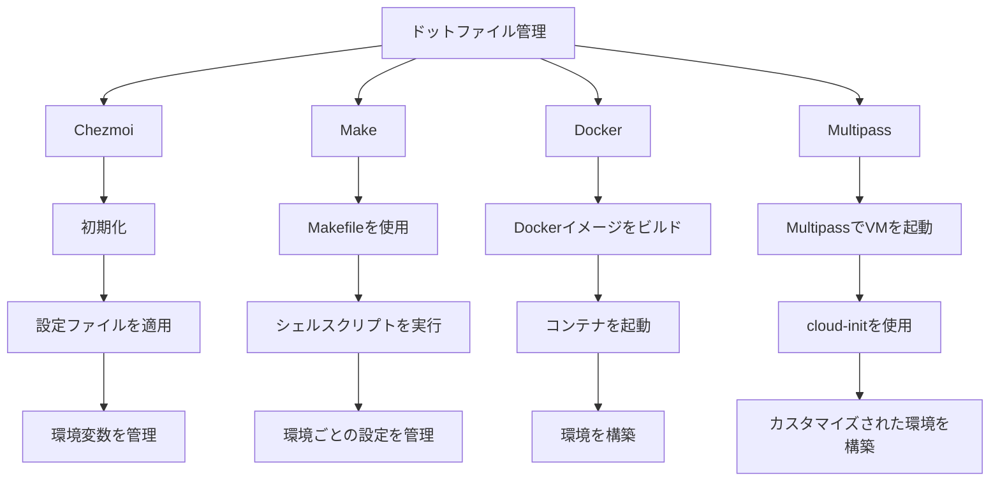

<link href="./style.css" rel="stylesheet"></link>

# dotfiles

### v.0.2.1

- このリポジトリは、私のドットファイルを管理するためのものです。
- さまざまなツールや設定ファイルを統合し、効率的な開発環境を構築することを目的としています。

## リポジトリのリンク

- GitHub リポジトリ: [budybye/dotfiles](https://github.com/budybye/dotfiles)

## 概要

- **対応OS**: MacOS Sonoma、Ubuntu 24.04
- **テスト**: GitHub Actionsを使用して、さまざまなOSでの動作を確認しています。
- **今後の計画**: arch64 と Windows でも WSL2 と Windows 用の設定ファイルを追加で管理する予定です。


## 目次

1. [XDG ディレクトリ構成](#xdg-ディレクトリ構成)
2. [OS差異](#os差異)
3. [Chezmoi](#chezmoi)
4. [Makefile](#Makefile)
5. [Github Actions](#github-actions)
6. [Mise](#mise)
7. [環境変数](#環境変数)
8. [Docker](#docker)
9. [Multipass](#multipass)

---

## XDG ディレクトリ構成

### [XDG Base Directory Specification](https://specifications.freedesktop.org/basedir-spec/basedir-spec-latest.html)

- XDG Base Directory Specification に基づくディレクトリの設定を行います。
- 環境変数で設定できますが、なるべくデフォルトを使用します。
- 特に .config は様々なツールに使用されているので、なるべく採用します。

- **XDG_CONFIG_HOME**: ユーザー固有の設定ファイルの格納先。
- **XDG_DATA_HOME**: ユーザー固有のデータファイルの格納先。
- **XDG_CACHE_HOME**: ユーザー固有のキャッシュファイルの格納先。
- **XDG_STATE_HOME**: ユーザー固有の状態ファイルの格納先。
- **XDG_DATA_DIRS**: システム全体のデータファイルの検索パス。
- **XDG_CONFIG_DIRS**: システム全体の設定ファイルの検索パス。

```tree:~/
~/
├── .config                         # XDG ディレクトリ構成に基づく設定ファイル
│   ├── vscode                     
│   │   ├── extensions.json         # VSCode の拡張機能の設定ファイル
│   │   └── User
│   │       ├── setting.json        # VSCode の設定ファイル
│   │       └── keybindings.json    # VSCode のキーバインド設定ファイル
│   ├── git                         
│   │   ├── config                  # Git の設定ファイル
│   │   ├── ignore                  # Git の無視ファイルの設定ファイル
│   │   ├── commit.template         # Git のコミットメッセージのテンプレート
│   │   └── user.conf               # Git のユーザー設定ファイル
│   ├── mise                        
│   │   └── config.toml             # mise の設定ファイル
│   ├── chezmoi                     
│   │   └── config.yaml             # chezmoi の設定ファイル
│   ├── sheldon                    
│   │   └── plugins.toml            # sheldon のプラグインの設定ファイル
│   ├── aquaproj-aqua              
│   │   └── aqua.yaml               # aqua の設定ファイル
│   ├── byobu                      
│   │   └── .tmux.conf              # byobu の設定ファイル
│   ├── tabby                       
│   │   └── config.yaml             # tabby の設定ファイル
│   ├── vim                        
│   │   └── vimrc                   # vim の設定ファイル
│   ├── fcitx5                      
│   │   └── config                  # fcitx5 の設定ファイル
│   ├── fusuma                      
│   │   └── config.yml              # fusuma の設定ファイル
│   ├── neofetch                    
│   │   └── config.conf             # neofetch の設定ファイル
│   ├── fish
│   │   └── config.fish             # fish の設定ファイル
│   ├── mpd
│   │   └── mpd.conf                # mpd の設定ファイル
│   ├── ncmpcpp
│   │   └── config                  # ncmpcpp の設定ファイル
│   ├── .editorconfig               # editorconfig の設定ファイル
│   ├── Brewfile                    # Brewfile
│   └── starship.toml               # starship の設定ファイル
├── .local                          # ローカルユーザーディレクトリ
│   ├── share
│   │   ├── fonts                   # フォントのディレクトリ
│   │   ├── backgrounds             # 壁紙のディレクトリ
│   │   └── themes                  # テーマのディレクトリ
│   └── bin
│       ├── init.sh                 # Chezmoi の初期化スクリプト make init
│       ├── install.sh              # Ubuntu のインストールスクリプト make install
│       ├── setup.sh                # Ubuntu のセットアップスクリプト make setup
│       ├── bootstrap.sh            # MacOS のブートストラップスクリプト make bootstrap
│       ├── defaults.sh             # MacOS のデフォルトスクリプト make defaults
│       └── codex.sh                # VSCode のスクリプト make code
├── .devcontainer                   
│    ├── .devcontainer.json         # devcontainer の設定ファイル
│    ├── Dockerfile                 # Dockerfile
│    └── docker-compose.yaml        # docker-compose の設定ファイル
├── .github                         
│    └── workflows                 
│       └── .test.yaml              # Github Actions のテストの設定ファイル
├── .profile                        # ログインシェルに共通で読み込まれるファイル
├── .aliases                        # エイリアスの設定ファイル
├── .zshrc                          # zsh の設定ファイル
├── .zshenv                         # zsh の環境変数
├── .bashrc                         # bash の設定ファイル
├── .bash_profile                   # bash の環境変数
├── .Makefile                       # Make で シェルスクリプトを設定管理 make sense
├── .mise.toml                      # mise の設定ファイル .env を読み込む
├── .env                            # 環境変数の設定ファイル
├── .chezmoiignore                  # chezmoi の除外ファイル
├── data                            # データのディレクトリ
├── multipass.yaml                  # Multipass のcloud-init ファイル
├── Applications                    # AppImage 系のディレクトリ
├── etc...                          # その他
```

- **シェル設定**: ログインシェルやインタラクティブシェルで読み込まれるファイル。
- **Makefile**: Makefile で シェルスクリプトを設定管理。
- **.local/bin**: 初期設定用などのシェルスクリプトを格納するディレクトリ。
- **.devcontainer**: docker, devcontainer使用する設定ファイル。
- **.github**: Github Actions の設定ファイル。OS 差異のテスト用やイメージビルド用。
- **~/.config**: 様々なツールやアプリケーションの設定を管理するためのファイル。
- **.local/share**: ユーザーがインストールしたフォントや壁紙などの共有リソースを格納するディレクトリ。

---

## OS差異

### 1. Chezmoiの活用

- [ ] **クロスプラットフォーム対応**: macOS、Linux、Windows間でドットファイルを同期
- [ ] **セキュリティ**: シークレットファイルを暗号化して管理
- [ ] **テンプレート機能**: 環境ごとの設定を柔軟にカスタマイズ

### 2. Makeとの併用

- [ ] **特定の設定やスクリプトの自動化**: Makefileを使用
- [ ] **Chezmoiとの連携**: ドットファイルの管理はChezmoiに任せる

### 3. .devcontainerとの統合

- [ ] **Dev Containers内でChezmoiを使用**: コンテナ起動時に自動的にドットファイルを適用

### 4. Github Actions でテスト


  
| OS         | 管理方法               | コメント                           |
|------------|-----------------------|------------------------------------|
| macOS      | Make                  | スクリプトの実行や環境設定に適している |
| Ubuntu     | Make                  | 同上                               |
| Windows    | Chezmoi               | Windows特有の設定を管理するのに適している |

| メリット | デメリット |
|----------|-------------|
| 一貫性のある開発環境 | 学習コストがかかる |
| 環境の再現性 | リソースの消費 |
| 依存関係の管理 | 複雑性の増加 |

---

## [Chezmoi](https://chezmoi.io/) の使用

### Chezmoi を使用して Dotfiles を管理します。

```sh
# 初期化
chezmoi init --apply budybye

# cd コマンドで移動 ~/.local/share/chezmoi
chezmoi cd
# 変更を適用
chezmoi apply < option Filename >
# ファイルを追加
chezmoi add --follow < Filename >
# ファイルの属性を変更
chezmoi chattr < Filename >
```

### 説明

- `init`: Chezmoi のリポジトリを初期化し、設定を適用します。
- `cd`: Chezmoi の管理ディレクトリに移動します。
- `apply`: 指定したオプションファイルを適用します。
- `add`: ファイルを Chezmoi の管理対象に追加します。
- `chattr`: ファイルの属性を変更します。

---

## [Makefile](https://.gnu.org/software/make/manual/make.html)

### Makefile でシェルスクリプトを管理します。

```sh
# 環境ごとに分けたシェルスクリプトを実行
make sense

# シェルスクリプトを実行
make install
make bootstrap
make setup
make init
```

```Makefile:.Makefile
ifeq ($(OS),Darwin  )
    # MacOS の場合
    sense: init bootstrap
else ifeq ($(OS),Linux)
    # Ubuntu の場合
    sense: init install setup
endif

# 環境ごとに分けたシェルスクリプトを指定
install:
    sh $(HOME)/.local/bin/install.sh
bootstrap:
    sh $(HOME)/.local/bin/bootstrap.sh
setup:
    sh $(HOME)/.local/bin/setup.sh
init:
    curl -sfL https://git.io/chezmoi | sh -s -- init --apply -S .
...
```

---

## [Github Actions](https://docs.github.com/en/actions)

- Main Branch に Push されたときにテストします。
- Github Actions を使用すると様々なOSでテストできます。
- Docker 製の action を使用して image を build して push できます。
- やろうと思えば arm64 や windows でもテストできるかもしれません。

### test.yaml でテスト

```yaml:.github/workflows/.test.yaml

jobs:
  # ubuntu 24.04 でテスト
  ubuntu:
    runs-on: ubuntu-24.04
    steps:
      - uses: actions/checkout@v4
      # make 経由でシェルスクリプトを実行
      - run: make sense
    ...
  # macos sonoma でテスト
  macos:
    runs-on: macos-14
    ...
  # docker でテスト
  docker:
    runs-on: ubuntu-latest
    steps:
      # docker製のアクションを使用
      - uses: docker/login-action@v3
      - uses: docker/setup-buildx-action@v3
      - uses: docker/setup-qemu-action@v3 # クロスプラットフォーム対応 遅い？
      - uses: docker/build-push-action@v5
    ...
  # windows でテスト
  windows:
    runs-on: windows-latest
    ...
```
---

## [Mise](https://mise.jdx.dev/) の使用

### Mise を使用してツールを管理します。

```sh
# ツールをインストール
mise use < tool@version >
# global にインストール
mise use -g < tool@version >

# インストールしたツールを確認
mise ls

# .mise.toml の指定ファイルを信頼
mise trust
```

### 説明

- `use`: 特定のツールとバージョンを使用します。
- `ls`: インストールされているツールの一覧を表示します。
- `trust`: 信頼できるリポジトリを設定します。
- `.mise.toml`: Mise の設定ファイル

---

## 環境変数

### 設定ファイルを作成

```sh
touch ./.mise.toml

touch ./.env
```

### ./.env に環境変数を記述

```sh
# .gitignore で.env ファイルを除外

# .env 例
export GITHUB_AUTHOR_NAME=budybye
```

### ./.mise.toml で読み込むファイル名を指定

```toml:./.mise.toml
[env]
'_'.file = ".env*"
```

### 現在のディレクトリを信頼してファイルを読み込み

```
# 環境変数が反映される
mise trust
echo $VAR

# 出力 hoge
```

### 説明

- `.env` に必要な環境変数を設定します。
- ~/.config/mise/config.toml で自動で読み込む(mise trust と同じ)ファイル名を指定できます。

---

## [Docker](https://docker.com/) の使用

- Dockerfile で Ubuntu のイメージをビルドしてプッシュ
- Docker コンテナ内で xrdp と xfce を使用した Ubuntu 環境を構築
- [devcontainer](https://docs.github.com/en/codespaces/setting-up-your-project-for-codespaces/creating-a-dev-container-configuration) で使用

```sh
# コンテナをビルド
docker build -t ubuntu-xrdp .
# イメージをプッシュ
docker push ubuntu-xrdp

# コンテナを起動
docker compose up -d
# コンテナ内に入る
docker compose exec ubuntu /bin/bash
```

---

## [Multipass](https://multipass.run/) の使用

### Multipass で cloud-init を使用して Ubuntu を起動

```sh
# オプションでカスタマイズ
# -n VM 名
# -c コア数
# -m メモリ
# -d ディスク
# --timeout タイムアウト時間 3600秒 = 1時間
# --mount マウント  from:to
# --cloud-init cloud-init の設定ファイルを指定

multipass launch \
  -n ubuntu \
  -c 4 \
  -m 4G \
  -d 40G \
  --timeout 3600 \
  --mount ${HOME}/data:/home/ubuntu/mount \
  --cloud-init ${HOME}/multipass.yaml
```

---

## 参考文献

- [chezmoi](https://chezmoi.io/)
- [Makefile](https://www.gnu.org/software/make/manual/make.html)
- [mise](https://mise.jdx.dev/)
- [multipass](https://multipass.run/)
- [Docker](https://docker.com/)
- [Github Actions](https://docs.github.com/en/actions)
- [devcontainer](https://docs.github.com/en/codespaces/setting-up-your-project-for-codespaces/creating-a-dev-container-configuration)
- [starship](https://starship.rs/)
- [sheldon](https://sheldon.cli.rs/Introduction.html)
- [fzf](https://github.com/junegunn/fzf)
- [homebrew](https://brew.sh/)
- [xfce](https://xfce.org/)
- [xrdp](https://xrdp.org/)
- [cloudflare warp](https://developers.cloudflare.com/warp-client)
- [cloud-init-linter](https://github.com/anderssonPeter/cloud-init-linter)
- [byobu](https://byobu.co/)
- [tabby](https://tabby.sh/)
- [neofetch](https://github.com/dylanaraps/neofetch)
- [fcitx5](https://github.com/fcitx/fcitx5)
- [fusuma](https://github.com/iberianpig/fusuma)
- [aqua](https://aquaproj.github.io/)
- [zoxide](https://github.com/ajeetdsouza/zoxide)
- [tldr](https://tldr.sh/)
- [kubectl](https://kubernetes.io/docs/reference/kubectl/)
- [monokai-pro](https://github.com/monokai/monokai-pro)
