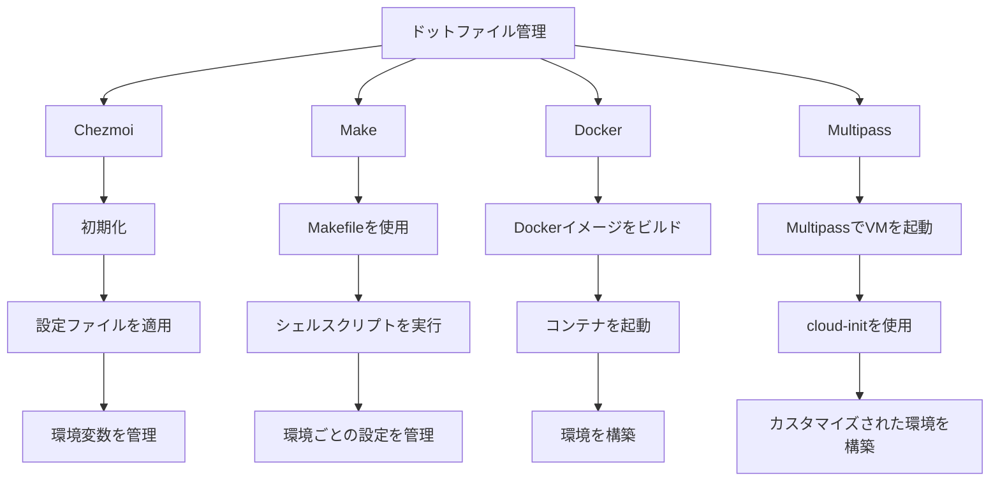
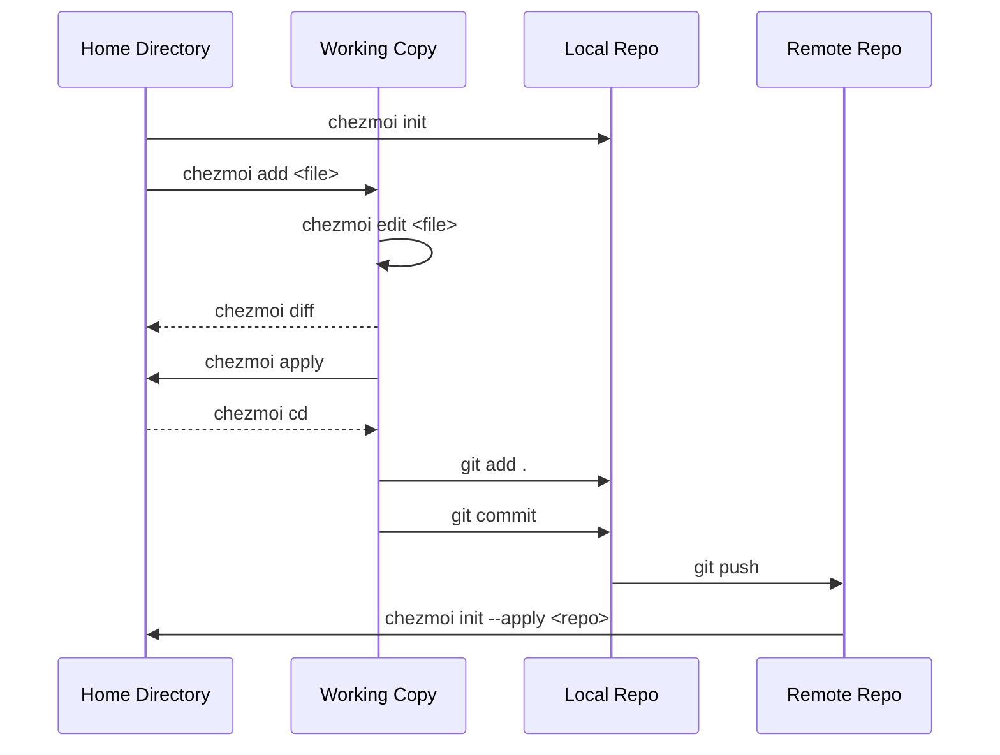

<link href="./style.css" rel="stylesheet"></link>

# dotfiles

## v.0.2.2

### 🏴‍☠ [budybye/dotfiles](https://github.com/budybye/dotfiles)


- このリポジトリは、私、個人の設定ファイルを管理するためのものです。
- さまざまなツールや設定ファイルを統合、管理、改善して、効率的に設定された環境を構築することを目的としています。
- `MacOS` と `Ubuntu` の設定ファイルを管理しています。
- `Docker` や `Multipass` でも環境設定しています。
- 複雑でなければ `Ansible` や `Terraform` も追加予定...
- `.github/workflows/*.yaml` で環境ごとのテストを行っています。
- `SSH` やシークレットな情報は `.env` `age` `Bitwarden` で管理しています。

### 初期設定

- `curl` `git` `make` が必要です。

```sh
curl -fsLS https://chezmoi.io/get | sh -s -- init --apply --verbose git@github.com:budybye/dotfiles.git
# or
chezmoi init --apply --verbose git@github.com:budybye/dotfiles.git

# ~/に配置する場合
cd ~
git clone git@github.com:budybye/dotfiles.git
cd dotfiles
make sense
```

### git グローバル設定

```sh
# 環境変数 を設定していたら
cat <<EOF >~/.config/git/user.conf
[user]
    name = ${GIT_AUTHOR_NAME}
    email = ${GIT_AUTHOR_EMAIL}
EOF
# or
git config --global user.name ${GIT_AUTHOR_NAME}
git config --global user.email ${GIT_AUTHOR_EMAIL}
# コミットメッセージのテンプレート
git config --global commit.template ~/.config/git/commit_template
``` 

---

## 概要

- **対応OS**: `MacOS` Sequoia、`Ubuntu` 24.04
- **テスト**: `GitHub Actions` を使用して、さまざまなOSでの動作を確認しています。
- **今後の計画**: `arm64` 互換と `WSL2` と `Windows` 用の設定ファイルを追加で管理する予定です。

## 目次

1. [XDG ディレクトリ構成](#XDG-Base-Directory)
2. [管理方法](#管理方法)
3. [Chezmoi](#Chezmoi)
4. [Makefile](#Makefile)
5. [Github Actions](#Github-Actions)
6. [Mise](#Mise)
7. [環境変数](#環境変数)
9. [Docker](#Docker)
10. [Multipass](#Multipass)
11. [参考文献](#参考文献)

---

## XDG Base Directory

### [XDG Base Directory Specification](https://specifications.freedesktop.org/basedir-spec/basedir-spec-latest.html)

- XDG Base Directory Specification に基づくディレクトリの設定を行います。
- **XDG_CONFIG_HOME**: ユーザー固有の設定ファイルの格納先。
- **XDG_DATA_HOME**: ユーザー固有のデータファイルの格納先。
- **XDG_CACHE_HOME**: ユーザー固有のキャッシュファイルの格納先。
- **XDG_STATE_HOME**: ユーザー固有の状態ファイルの格納先。
- **XDG_DATA_DIRS**: システム全体のデータファイルの検索パス。
- **XDG_CONFIG_DIRS**: システム全体の設定ファイルの検索パス。
- 環境変数で設定できますが、なるべくデフォルトを使用します。
- 特に `~/.config` は様々なツールに使用されているので、なるべく採用します。

```
~/
├── .config                         # XDG ディレクトリ構成に基づく設定ファイル
│   ├── vscode
│   │   ├── extensions.json         # VSCode の拡張機能の設定ファイル
│   │   └── User
│   │       ├── setting.json        # VSCode の設定ファイル
│   │       └── keybindings.json    # VSCode のキーバインド設定ファイル
│   ├── git                         
│   │   ├── config                  # Git の設定ファイル
│   │   ├── ignore                  # Git の無視ファイルの設定ファイル
│   │   ├── commit.template         # Git のコミットメッセージのテンプレート
│   │   └── user.conf               # Git のユーザー設定ファイル
│   ├── mise                        
│   │   └── config.toml             # mise の設定ファイル
│   ├── chezmoi                     
│   │   └── config.yaml             # chezmoi の設定ファイル
│   ├── sheldon                    
│   │   └── plugins.toml            # sheldon のプラグインの設定ファイル
│   ├── aquaproj-aqua              
│   │   └── aqua.yaml               # aqua の設定ファイル
│   ├── byobu                      
│   │   └── .tmux.conf              # byobu の設定ファイル
│   ├── tabby                       
│   │   └── config.yaml             # tabby の設定ファイル
│   ├── vim                        
│   │   └── vimrc                   # vim の設定ファイル
│   ├── fcitx5                      
│   │   └── config                  # fcitx5 の設定ファイル
│   ├── fusuma                      
│   │   └── config.yml              # fusuma の設定ファイル
│   ├── neofetch                    
│   │   └── config.conf             # neofetch の設定ファイル
│   ├── fish
│   │   └── config.fish             # fish の設定ファイル
│   ├── mpd
│   │   └── mpd.conf                # mpd の設定ファイル
│   ├── ncmpcpp
│   │   └── config                  # ncmpcpp の設定ファイル
│   ├── .editorconfig               # editorconfig の設定ファイル
│   ├── Brewfile                    # Brewfile
│   └── starship.toml               # starship の設定ファイル
├── .local                          # ローカルユーザーディレクトリ
│   ├── share
│   │   ├── fonts                   # フォントのディレクトリ
│   │   ├── backgrounds             # 壁紙のディレクトリ
│   │   └── themes                  # テーマのディレクトリ
│   └── bin
│       ├── init.sh                 # Chezmoi の初期化スクリプト make init
│       ├── install.sh              # Ubuntu のインストールスクリプト make install
│       ├── setup.sh                # Ubuntu のセットアップスクリプト make setup
│       ├── bootstrap.sh            # MacOS のブートストラップスクリプト make bootstrap
│       ├── defaults.sh             # MacOS のデフォルトスクリプト make defaults
│       └── codex.sh                # VSCode のスクリプト make code
├── .devcontainer                   
│    ├── .devcontainer.json         # devcontainer の設定ファイル
│    ├── Dockerfile                 # Dockerfile
│    └── docker-compose.yaml        # docker-compose の設定ファイル
├── .github                         
│    └── workflows                 
│       └── .test.yaml              # Github Actions のテストの設定ファイル
├── .profile                        # ログインシェルに共通で読み込まれるファイル
├── .aliases                        # エイリアスの設定ファイル
├── .zshrc                          # zsh の設定ファイル
├── .zshenv                         # zsh の環境変数
├── .bashrc                         # bash の設定ファイル
├── .bash_profile                   # bash の環境変数
├── .Makefile                       # Make で シェルスクリプトを設定管理 make sense
├── .mise.toml                      # mise の設定ファイル .env を読み込む
├── .env                            # 環境変数の設定ファイル
├── .chezmoiignore                  # chezmoi の除外ファイル
├── data                            # データのディレクトリ
├── multipass.yaml                  # Multipass のcloud-init ファイル
├── Applications                    # AppImage 系のディレクトリ
├── etc...                          # その他
```

- **シェル設定**: ログインシェルやインタラクティブシェルで読み込まれるファイル。
- **Makefile**: `Makefile` で シェルスクリプトを設定管理。
- **.local/bin**: 初期設定用などのシェルスクリプトを格納するディレクトリ。
- **.devcontainer**: `docker` と `devcontainer` 使用する設定ファイル。
- **.github**: `Github Actions` の設定ファイル。OS 差異のテスト用やイメージビルド用。
- **~/.config**: 様々なツールやアプリケーションの設定を管理するためのファイル。
- **.local/share**: ユーザーがインストールしたフォントや壁紙などの共有リソースを格納するディレクトリ。

---

## 管理方法

### 1. Chezmoiの活用

- [x] **クロスプラットフォーム対応**: macOS、Linux、Windows間でドットファイルを同期
- [x] **セキュリティ**: シークレットファイルを暗号化して管理
- [x] **テンプレート機能**: 環境ごとの設定を柔軟にカスタマイズ

### 2. Makeとの併用

- [x] **特定の設定やスクリプトの自動化**: Makefileを使用
- [x] **Chezmoiとの連携**: ドットファイルの管理はChezmoiに任せる

### 3. .devcontainerとの統合

- [x] **Dev Containers内でChezmoiを使用**: コンテナ起動時に自動的にドットファイルを適用

### 4. Github Actions でテスト





### 管理方法

| OS         | 管理方法               | コメント                           |
|------------|-----------------------|------------------------------------|
| macOS      | Make                  | スクリプトの実行や環境設定に適している |
| Ubuntu     | Make                  | 同上                               |
| Windows    | Chezmoi               | Windows特有の設定を管理するのに適している |

### メリットとデメリット

| メリット | デメリット |
|----------|-------------|
| 一貫性のある開発環境 | 学習コストがかかる |
| 環境の再現性 | リソースの消費 |
| 依存関係の管理 | 複雑性の増加 |

### ツールのインストール

|  | MacOS | Ubuntu | Docker  |
| --- | :---: | :---: | :---: |
| Chezmoi | brew | mise | mise |
| Script | make | make | make |
| Makefile | make | make | make |
| Zsh | default | apt | apt |
| Git | brew | apt | apt |
| Github Actions | ✅ | ✅ | ✅ |
| Github CLI | brew | apt | apt |
| Bitwarden CLI | brew | snap/npm | snap/npm |
| Docker | brew | apt | apt |
| Dev Container | ✅ | ✅ | ✅ |
| Multipass | brew | snap | snap |
| Homebrew | ✅ |  |  |

| CLI Tool | MacOS | Ubuntu | Docker |
| --- | :---: | :---: | :---: |
| Byobu | brew | apt | apt |
| Vim | brew | apt | apt |
| Fish | brew | apt | apt |
| aqua VM | brew | apt | apt |
| MPD | brew | apt | apt |
| Ncmpcpp | brew | apt | apt |
| fcitx5 |  | apt | apt |
| Neofetch | fastfetch | apt | apt |

| Rust Tool | MacOS | Ubuntu | Docker |
| --- | :---: | :---: | :---: |
| Mise | brew | curl | curl |
| Starship | brew | mise/cargo | mise/cargo |
| Sheldon | brew | cargo | cargo |
| lsd | brew | apt | apt |
| bat | brew | apt | apt |
| ripgrep | brew | apt | apt |
| fzf | brew | apt | apt |
| zoxide | brew | apt | apt |
| fd-find | brew | apt | apt |

| Language | MacOS | Ubuntu | Docker |
| --- | :---: | :---: | :---: |
| Node.js | mise | mise | mise |
| Bun | mise | mise | mise |
| Deno | mise | mise/snap | mise/snap |
| Go | mise | mise/snap | mise/snap |
| Python | mise | mise/apt | mise/apt |
| Java | mise | mise/apt | mise/apt |
| Rust | mise | mise/apt | mise/apt |
| Ruby | mise | mise/apt | mise/apt |

| Desktop | MacOS | Ubuntu | Docker |
| --- | :---: | :---: | :---: |
| Xfce4 |  | apt | apt |
| Xrdp |  | apt | apt |
| VSCode | brew |  | apt |
| VSCodium |  | snap | snap |
| Cursor | brew | AppImage | AppImage |
| Github Desktop | brew | apt | apt |
| Tabby | brew | apt | apt |
| Brave | brew | apt | apt |
| Cloudflare Warp | brew | apt | apt |
| Wireshark | brew | apt | apt |
| Fusuma |  | gem | gem |
| Karabiner-Elements | brew |  |  |

---

## [Chezmoi](https://chezmoi.io/) の使用

### Chezmoi を使用して Dotfiles を管理します。

- `chezmoi init` で初期化して `chezmoi cd` で移動して `chezmoi add` でファイルを追加します。
- `chezmoi apply` で変更を適用します。
- `chezmoi diff` で差分を確認します。
- `chezmoi chattr` でファイルの属性を変更します。
- `chezmoi update` でリモートからの状態を反映します。

```sh
# インストールされてない場合
curl -sfL https://chezmoi.io/get | sh -s -- init --apply budybye
# or
make init

# MacOS
brew install chezmoi

# 初期化 ~/.local/share/chezmoi が作成されて ~/ 以下に反映される
chezmoi init --apply budybye
# cd コマンドで移動 ~/.local/share/chezmoi
chezmoi cd
# ファイルを追加
chezmoi add < Filename >
# ファイルを追加(シンボリックリンク)
chezmoi add --follow < Filename >
# ファイルの差分を確認
chezmoi diff < option Filename >
# 変更を適用
chezmoi apply < option Filename >
# ファイルの属性を変更
chezmoi chattr < Filename >
# リモートからの状態を反映
chezmoi update
```

---

## [Makefile](https://.gnu.org/software/make/manual/make.html)

### Makefile でシェルスクリプトを管理。

```sh
# 環境ごとに分けたシェルスクリプトを実行
make sense
# シェルスクリプトを実行
make init
make install
make bootstrap
make defaults
make setup
make code
make link
make keygen
```

```Makefile:Makefile
ifeq ($(OS),Darwin  )
    # MacOS の場合
    sense: init bootstrap
else ifeq ($(OS),Linux)
    # Ubuntu の場合
    sense: init install setup
endif

# 環境ごとに分けたシェルスクリプトを指定
install:
    sh $(HOME)/.local/bin/install.sh
bootstrap:
    sh $(HOME)/.local/bin/bootstrap.sh
setup:
    sh $(HOME)/.local/bin/setup.sh
init:
    curl -sfL https://chezmoi.io/get | sh -s -- init --apply -S .
...
```

- `make sense` で環境ごとに分けた初期設定用のシェルスクリプトを実行できます。
- `chezmoi` と `make` を連携してドットファイルを管理します。
- `make.log` を出力してログを確認できます。
- ほとんどの環境でデフォルトで `make` が使えます。

---

## [Github Actions](https://docs.github.com/en/actions)

- `Main Branch` に Push されたときにテストします。
- `Github Actions` を使用すると様々なOSでテストできます。
- `Docker` 製の action を使用して Image を Build して `Github Packages` に Push できます。
- `Cross Platform` 対応の Image を作成して `Github Packages` に Push したい。
- `Runs_On` が対応しているので `arm64` や `Windows` でもテストできるかもしれません。

### test.yaml でテスト

```yaml:.github/workflows/.test.yaml

jobs:
  # ubuntu 24.04 でテスト
  ubuntu:
    runs-on: ubuntu-24.04
    steps:
      - uses: actions/checkout@v4
      # make 経由でシェルスクリプトを実行
      - run: make sense
    ...
  # macos sequoia でテスト
  macos:
    runs-on: macos-15
    ...
  # docker でテスト
  docker:
    runs-on: ubuntu-latest
    steps:
      # docker製のアクションを使用
      - uses: docker/login-action@v3
      - uses: docker/setup-buildx-action@v3
      - uses: docker/setup-qemu-action@v3 # クロスプラットフォーム対応 遅い？
      - uses: docker/build-push-action@v5
    ...
  # windows でテスト
  windows:
    runs-on: windows-latest
    ...
```
---

## [Mise](https://mise.jdx.dev/)

### Mise を使用してプログラミングツールやCLIツールを管理します。

```sh
# ツールをインストール
mise use < tool@version >
# global にインストール
mise use -g < tool@version >
# インストールしたツールを確認
mise ls
# .mise.toml の指定ファイルを信頼
mise trust
# 環境変数を表示
mise set
```

- `asdf` と 互換性があり `tool-versions` ファイルを使用できます。
- ディレクトリ毎にツールや環境変数を管理できます。
- `mise trust` でファイルを信頼して環境変数を読み込みます。
- `chezmoi` や `starship` もインストール管理できます。
- 依存関係は自動で解決できないことがあるので注意が必要です。
- ツールのバージョンを指定してインストールしたり複数管理できます。
- `~/.config/mise/config.toml` でグローバルな設定ができます。
- `.mise.toml` でローカルな設定ができます。

## 環境変数

### 設定ファイルを作成

```sh
touch ./.mise.toml
touch ./.env
```

### ./.env に環境変数を記述

```sh
# .env 例
export GITHUB_AUTHOR_NAME=hoge
# .gitignore で.env ファイルを除外
```

### ./.mise.toml で読み込むファイル名を指定

```toml:./.mise.toml
[env]
_.file = ".env*"
```

### 現在のディレクトリを信頼してファイルを読み込み

```
# 環境変数が反映される
mise trust
echo $VAR

# 出力 hoge
```

### 説明

- `.env` に必要な環境変数を設定します。
- `~/.config/mise/config.toml` で自動で読み込むファイル名を指定できます。

---

## [Docker](https://docker.com/)

- `Dockerfile` で `Ubuntu` のイメージをビルドしてプッシュ
- `Docker` コンテナ内で `xrdp` と `xfce4` を使用した `Ubuntu` 環境を構築
- `Dev Container` で使用

```sh
# コンテナをビルド
docker build -t ubuntu-xrdp .
# イメージをプッシュ
docker push ubuntu-xrdp
# コンテナを起動
docker compose up -d
# コンテナ内に入る
docker compose exec ubuntu /bin/bash
```

---

## [Multipass](https://multipass.run/)

### Multipass で cloud-init を使用して Ubuntu を起動

```sh
# オプションでカスタマイズ
# -n VM 名
# -c コア数
# -m メモリ
# -d ディスク
# --timeout タイムアウト時間 3600秒 = 1時間
# --mount マウント  from:to
# --cloud-init cloud-init の設定ファイルを指定

multipass launch \
  -n ubuntu \
  -c 4 \
  -m 4G \
  -d 40G \
  --timeout 3600 \
  --mount ${HOME}/data:/home/ubuntu/mount \
  --cloud-init ${HOME}/cloud-init/multipass.yaml
```

---

## 参考文献

- [Chezmoi](https://chezmoi.io/)
- [Makefile](https://www.gnu.org/software/make/manual/make.html)
- [Mise](https://mise.jdx.dev/)
- [Multipass](https://multipass.run/)
- [Docker](https://docker.com/)
- [Docker Compose](https://docs.docker.com/compose/)
- [Github Actions](https://docs.github.com/en/actions)
- [Github Desktop](https://desktop.github.com/)
- [Github CLI](https://cli.github.com/)
- [Git](https://git-scm.com/)
- [ghcr](https://github.com/features/packages)
- [codespaces](https://docs.github.com/en/codespaces)
- [Dev Container](https://docs.github.com/en/codespaces/setting-up-your-project-for-codespaces/creating-a-dev-container-configuration)
- [Cursor](https://cursor.com)
- [VSCode](https://code.visualstudio.com/)
- [Zsh](https://zsh.org/)
- [Starship](https://starship.rs/)
- [Sheldon](https://sheldon.cli.rs/Introduction.html)
- [Fish](https://fishshell.com/)
- [Bitwarden](https://bitwarden.com)
- [Bun](https://bun.sh/)
- [Cargo](https://cargo.rust-lang.org/)
- [Go](https://go.dev/)
- [Vim](https://vim.org/)
- [IPFS](https://ipfs.io/)
- [Curl](https://curl.se/)
- [jq](https://github.com/jqlang/jq)
- [mkcert](https://github.com/FiloSottile/mkcert)
- [fzf](https://github.com/junegunn/fzf)
- [Homebrew](https://brew.sh/)
- [Xfce](https://xfce.org/)
- [xrdp](https://xrdp.org/)
- [Wireshark](https://wireshark.org/)
- [Editorconfig](https://editorconfig.org/)
- [Cloudflare Warp](https://developers.cloudflare.com/warp-client)
- [Wrangler](https://developers.cloudflare.com/wrangler)
- [Cloud-init-linter](https://github.com/anderssonPeter/cloud-init-linter)
- [Byobu](https://byobu.co/)
- [Tabby](https://tabby.sh/)
- [Neofetch](https://github.com/dylanaraps/neofetch)
- [ffmpeg](https://ffmpeg.org/)
- [MPD](https://www.musicpd.org/)
- [Ncmpcpp](https://github.com/ncmpcpp/ncmpcpp)
- [fcitx5](https://github.com/fcitx/fcitx5)
- [Fusuma](https://github.com/iberianpig/fusuma)
- [Karabiner-elements](https://karabiner-elements.pqrs.org/)
- [Aqua](https://aquaproj.github.io/)
- [zoxide](https://github.com/ajeetdsouza/zoxide)
- [tldr](https://tldr.sh/)
- [kubectl](https://kubernetes.io/docs/reference/kubectl/)
- [Portainer](https://portainer.io/)
- [Monokai-Pro](https://github.com/monokai/monokai-pro)
- [WhiteSur-GTK-Theme](https://github.com/vinceliuice/WhiteSur-gtk-theme)
- [Xfce-look](https://xfce-look.org/)
- [awesome](https://github.com/sindresorhus/awesome)
- [awesome-zsh-plugins](https://github.com/unixorn/awesome-zsh-plugins)
- [Rhino Linux](https://github.com/rhinolinux)
- [mac-defaults](https://github.com/kevinSuttle/macOS-Defaults)
- [Power Shell](https://docs.microsoft.com/en-us/powershell/)
- [Microsoft Remote Desktop](https://docs.microsoft.com/en-us/windows-server/remote/remote-desktop-services/clients/remote-desktop-mac)
- [WSL2](https://docs.microsoft.com/en-us/windows/wsl/wsl2-about)
- [Terraform](https://developer.hashicorp.com/terraform/tutorials/aws-get-started/install-cli)
- [AWS CLI](https://docs.aws.amazon.com/cli/latest/userguide/install-cliv2-mac.html)
- [Google Cloud CLI](https://cloud.google.com/sdk/docs/install-sdk)
- [DBeaver](https://dbeaver.io/)
- [Postman](https://www.postman.com/)
- [Insomnia](https://insomnia.rest/)
- [Caddy](https://caddyserver.com/)
- [Brave](https://brave.com/)
- [bookmarklet awesome](https://awesomebookmarklets.com/)
- [Tradingview](https://tradingview.com/)
- [Notion](https://notion.so/)
- [Obsidian](https://obsidian.md/)
- [Mp3tag](https://www.mp3tag.de/en/)
- [audacity](https://www.audacityteam.org/)
- [audacity-plugins-awesome](https://awesomeaudacityplugins.com/)
- [Blender](https://blender.org/)
- [Xcode](https://developer.apple.com/xcode/)
- [Android Studio](https://developer.android.com/studio)
- [Poetry](https://python-poetry.org/)
- [Jupyter Notebook](https://jupyter.org/)
- [Raspberry Pi](https://raspberrypi.org/)
- [Roboto Mono Nerd Font JP](https://github.com/yuru7/RobotoMonoNerdFontJP)
- [HackGen Nerd Font](https://github.com/yuru7/HackGenNerdFont)
- [Reggae One Font](https://fonts.google.com/specimen/Reggae+One)
- [Ansible](https://docs.ansible.com/)
- [Proxmox](https://www.proxmox.com/en/)
- [Vagrant](https://developer.hashicorp.com/vagrant/docs)
- [Flatpak](https://flatpak.org/)
- [Packer](https://developer.hashicorp.com/packer/docs)
