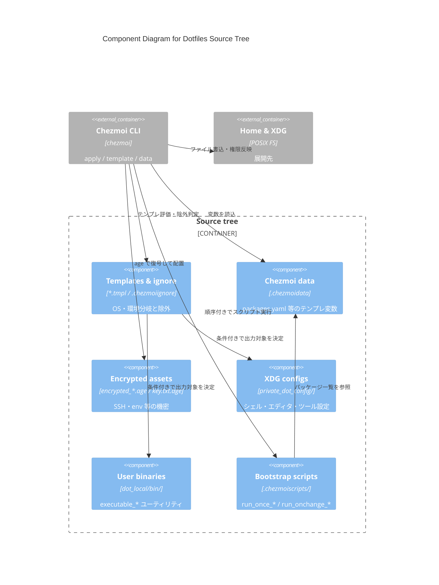

# C4 — Component: Source tree

**Scope:** `home/` を中心としたソースツリー内部の責務分割。  
**Audience:** 設定追加・テンプレ変更を行う開発者 / エージェント。

## 図

## コンポーネントメモ

| コンポーネント | 主なパス | 役割 |
| --- | --- | --- |
| Templates & ignore | `*.tmpl`, `.chezmoiignore`, `.chezmoi.toml.tmpl` | OS / CI / Docker 分岐 |
| Chezmoi data | `home/.chezmoidata/packages.yaml` | brew/apt/snap/mise 等の宣言 |
| Encrypted assets | `home/dot_ssh/encrypted_*`, `encrypted_private_executable_envars.age` | 機密のリポ内保管 |
| XDG configs | `home/private_dot_config/` | 適用後は `~/.config` |
| Bootstrap scripts | `home/.chezmoiscripts/{darwin,linux,windows}/` | 初回・変更時のホスト準備 |

ファイル属性プレフィックス（`dot_` / `private_` / `encrypted_` 等）は [directory.md](../directory.md) を参照。
