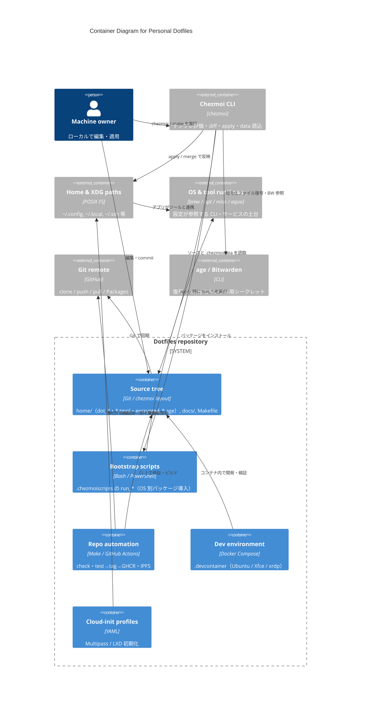

# C4 — Container (Level 2)

**Scope:** dotfiles リポジトリ内部と、適用パス上のランタイム側コンテナ。  
**前提:** ソースツリーの正は `chezmoi source-path`（通常は Git 作業ツリー）。

## 図

## コンテナの切り方メモ

- **Source tree** は独立デプロイのアプリではないが、このリポの **主要な成果物**（設定の正）なのでコンテナ相当として置く。
- **Bootstrap scripts** は source tree 内だが、apply 時にホストへ副作用を与える実行単位として分離した。
- **Chezmoi CLI** はリポに含めない外部ツールだが、**apply パスの中核**なので境界の外に明示する。
- mise / brew / apt 等は「設定が前提とするランタイム層」として 1 コンテナにまとめ、要素数を抑える。

詳細ディレクトリは [directory.md](../directory.md)。内部構成は [c4-components-source.md](./c4-components-source.md)。
