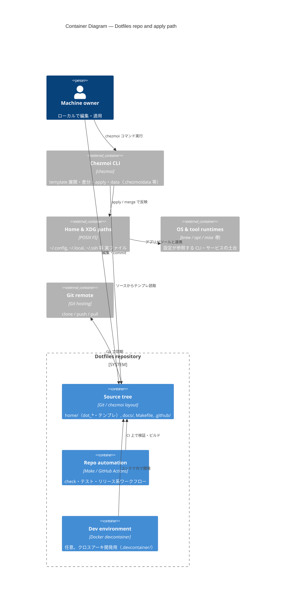

# C4 — Container (Level 2)

**Scope:** dotfiles リポジトリ内部と、それが接続するランタイム側の箱物。  
**前提:** ソースツリーの正は `chezmoi source-path`（通常は Git 作業ツリー）。

## 図

## コンテナの切り方メモ

- **Source tree**は「デプロイ可能な1アプリ」ではないが、このリポの **主要な成果物**（設定の正）なのでコンテナ相当として置く。
- **Chezmoi CLI**はリポに含めない外部ツールだが、**apply パスの中核**なので境界の外に明示した。

詳細ディレクトリは [directory.md](../directory.md)。
