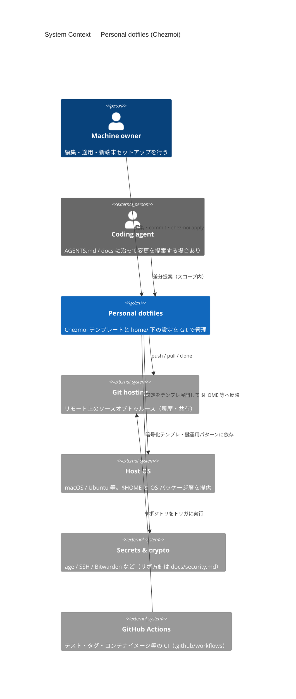

# C4 — System Context (Level 1)

**System:** Chezmoi で管理する個人 dotfiles（macOS / Ubuntu、XDG 準拠）。  
**Audience:** 新規メンバー・未来の自分・エージェント向けの境界確認。

## 図

## 読み方

- **ソフトウェアシステム**は「Git で持つ dotfiles 一式＋それを適用する運用」のまとまりとして扱っている（実行ファイルは chezmoi / ホストが担う）。
- **外部**は「ホスト」「リモート Git」「シークレット系」「CI」に分け、責務の擦れを減らす。

詳細な配置ルールは [directory.md](../directory.md)、スタックは [tech.md](../tech.md)。
