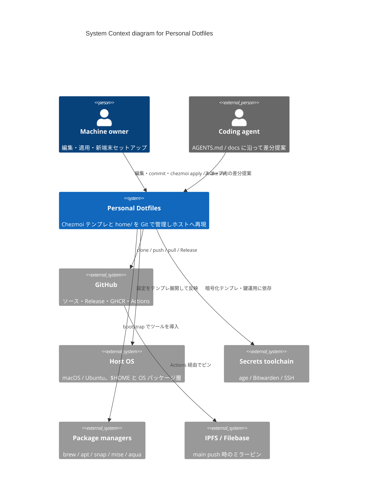

# C4 — System Context (Level 1)

**System:** Chezmoi で管理する個人 dotfiles（macOS / Ubuntu、XDG 準拠）。  
**Audience:** 新規メンバー・未来の自分・エージェント向けの境界確認。

## 図

## 読み方

- **ソフトウェアシステム**は「Git で持つ dotfiles 一式＋適用運用」のまとまり（実行は chezmoi / ホストが担う）。
- **外部**はホスト・GitHub・シークレット・パッケージマネージャ・IPFS に分け、責務の境界を明確にする。
- CI（GitHub Actions）は GitHub 側の能力として扱い、詳細は [c4-containers.md](./c4-containers.md) と [c4-dynamic-ci.md](./c4-dynamic-ci.md) を参照。

詳細な配置は [directory.md](../directory.md)、スタックは [tech.md](../tech.md)、セキュリティは [security.md](../security.md)。
