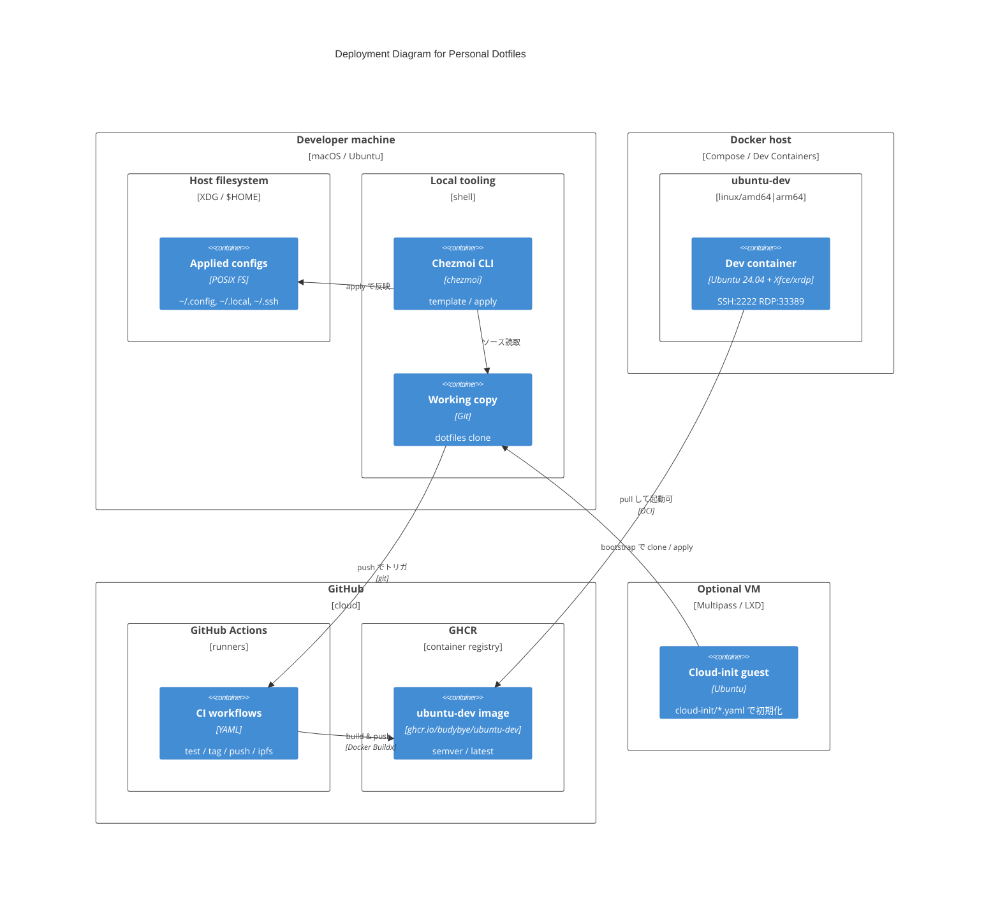

# C4 — Deployment (Level 4)

**Scope:** ローカルホスト・Dev Container・CI / GHCR・任意 VM への配置。  
**Audience:** DevOps / 自分自身の環境再現手順の把握。

## 図

## 配置メモ

- **ローカル:** `curl | chezmoi init --apply` または `make init` → `install.sh`。
- **コンテナ:** `.devcontainer/`（`make docker-run`）。ポートは RDP `33389→3389`、SSH `2222→22`。
- **CI 成果物:** semver タグ後に `ghcr.io/budybye/ubuntu-dev` を push（`push.yaml`）。`ipfs.yaml` はコンテナと独立して main をピン。
- **VM:** `make vm-create` + `cloud-init/`。

パイプライン詳細は [tech.md](../tech.md#github-actions-パイプライン) と [c4-dynamic-ci.md](./c4-dynamic-ci.md)。
