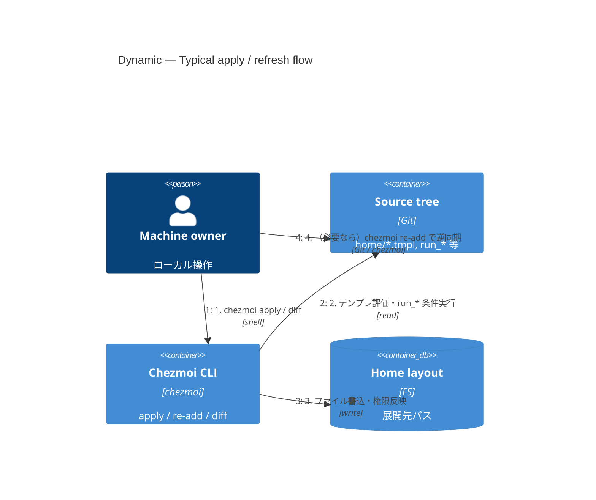

# C4 — Dynamic: `chezmoi apply` 周り

**用途:** ローカルで「ソース → ホーム反映」がどう流れるかを番号付きで追う。

## 図

## 補足

- 実際の分岐（OS テンプレ、encrypted、`run_once_*`）は [design.md](../design.md) や chezmoi 本体の手順に従う。
- **エージェント向け:** 変更後の検証は `git diff` / `jj diff` や `make check`（方針は [AGENTS.md](../../AGENTS.md)）。
