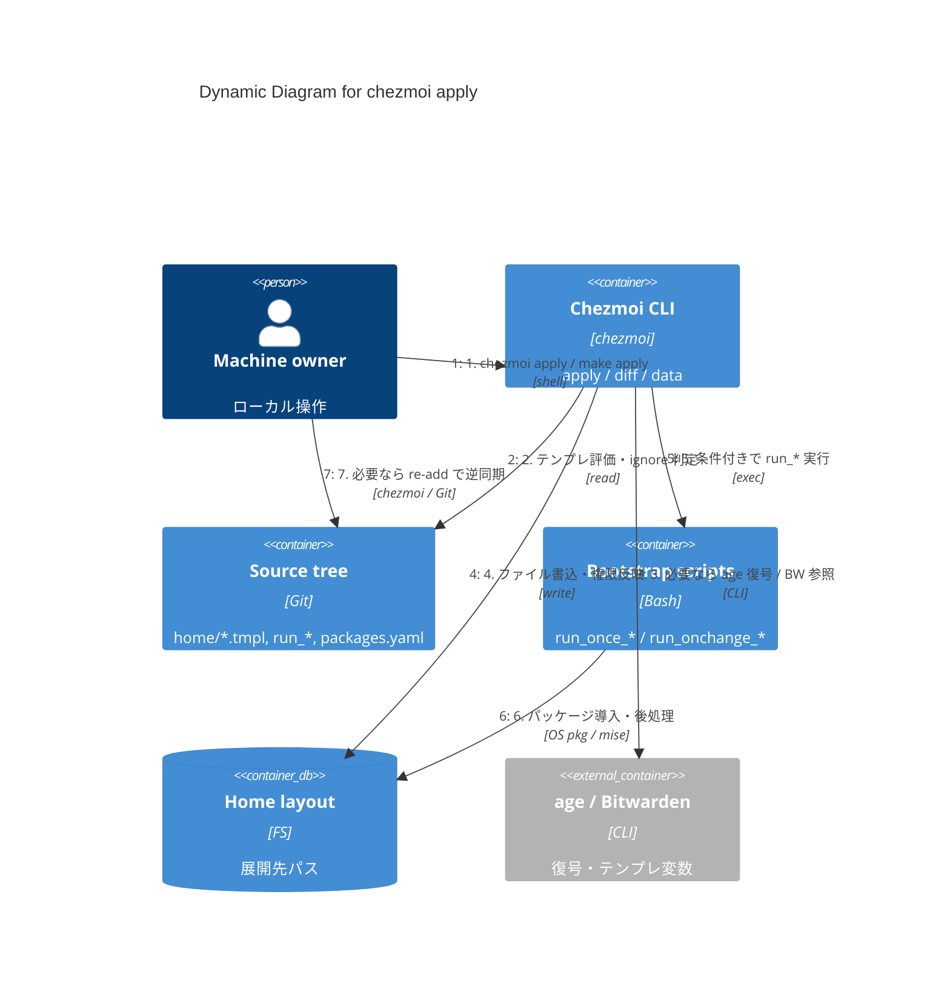

# C4 — Dynamic: `chezmoi apply`

**用途:** ローカルで「ソース → ホーム反映」がどう流れるかを番号付きで追う。

## 図

## 補足

- 分岐（OS テンプレ、encrypted、`run_once_*`、CI/Docker での age 無効化）は [design.md](../design.md) / [security.md](../security.md) に従う。
- 初回ブートストラップ（age → BW → パッケージ）は [c4-dynamic-bootstrap.md](./c4-dynamic-bootstrap.md)。
- 変更後の検証は `git diff` / `jj diff` や `make check`（[AGENTS.md](../../AGENTS.md)）。
