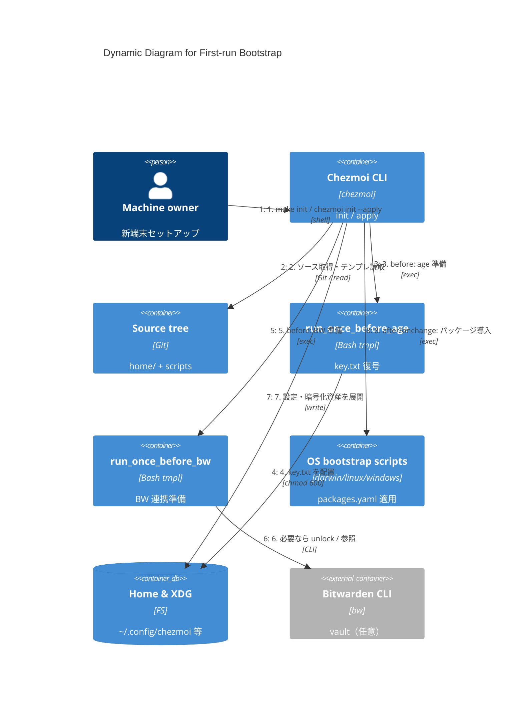

# C4 — Dynamic: 初回ブートストラップ

**用途:** 新しいマシンでシークレット準備からパッケージ導入までの典型フロー。

## 図

## 補足

- CI / Docker / 一部ユーザーでは `.chezmoi.toml.tmpl` により **age / Bitwarden が無効**（[security.md](../security.md)）。
- macOS は `darwin/run_onchange_after_bootstrap.sh.tmpl`、Linux は `linux/run_onchange_after_cli.sh.tmpl` 等がパッケージ導入の中心。
- `make bw-unlock` は適用前に vault を開く補助コマンド。
