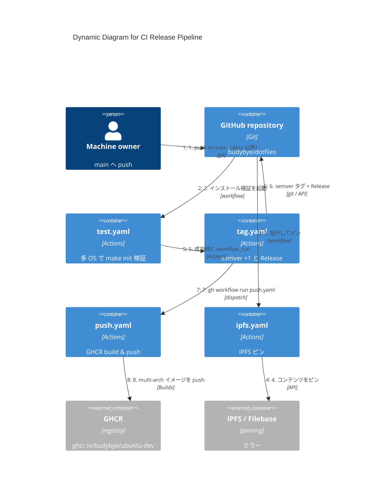

# C4 — Dynamic: CI / Release パイプライン

**用途:** `main` push からテスト・タグ・GHCR・IPFS までの流れ。

## 図

## 補足

- `docs/**` とルート `*.md` の変更は `test.yaml` の `paths-ignore` 対象。
- `push.yaml` は **main 単独 push では走らない**（`latest` と Release 済みイメージのズレ防止）。
- バージョンの単一ソースは git の semver タグ（`make version` / `DOTFILES_VERSION`）。

詳細は [tech.md](../tech.md#github-actions-パイプライン)。
