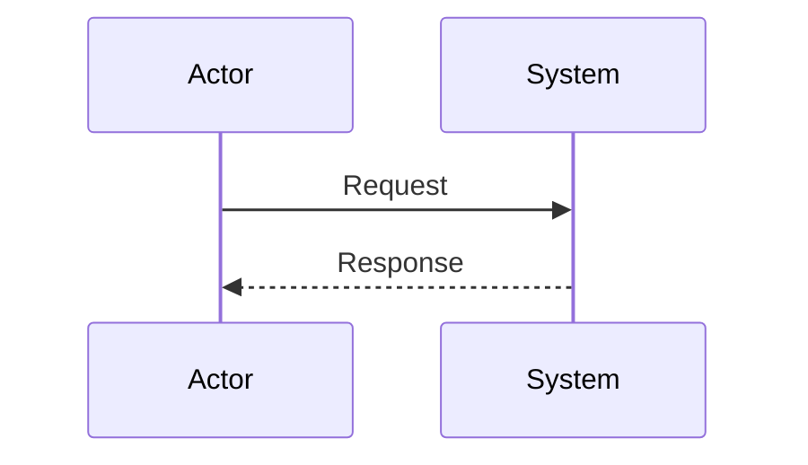
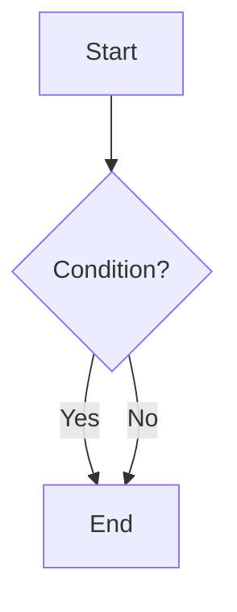
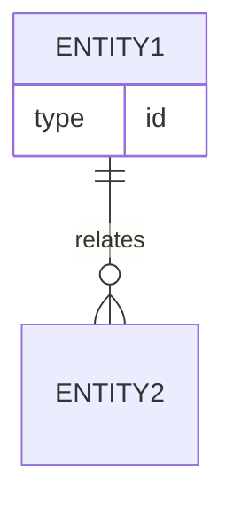
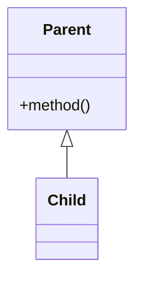

# Mermaid 図

テキストから図。**1 図 1 概念**。ノードが 10 個を超えるなら分割か subgraph。

## 種類の選び方

| 依頼の匂い | 図 |
|---|---|
| 認証/API の時系列 | `sequenceDiagram` |
| フロー・分岐 | `flowchart` |
| DB スキーマ | `erDiagram` |
| OO 構造 | `classDiagram` |
| 状態機械 | `stateDiagram-v2` |
| スケジュール | `gantt` |
| 複合システム | 複数図に分割 + 命名を揃える |

## 最小テンプレ（コピペ用）

## 構文メモ（エラーでハマるところ）

- **Sequence**: `->>` 同期、`-->>` 返答、`alt`/`else`/`end`、`opt`/`loop`。participant は先に宣言。
- **Flowchart**: 方向 `TD`/`LR`。`[ ]` 長方形、`{ }` ひし形、`(| )` スタート終了風。エッジラベルは `\|-->|ラベル|`。
- **ER**: エンティティは大文字でも可。`PK`/`FK` を属性行に。基数は `\|\|--o{` など公式記法で。
- **Class**: `<\|--` 継承、`-->` 関連。
- コメントは `%%`。長いラベルは `\n` で折る。

## ワークフロー

1. 実体と関係を一文ずつ列挙  
2. 図種決定  
3. 最小ノードだけ書いてレンダ確認  
4. 必要なら subgraph / スタイル  
5. 読み手向けにコメント `%%` で意図を足す  

## 品質チェック

構文エラーなし、関係が説明と矛盾しない、同じ抽象度で統一、横幅読みづらすぎない。
