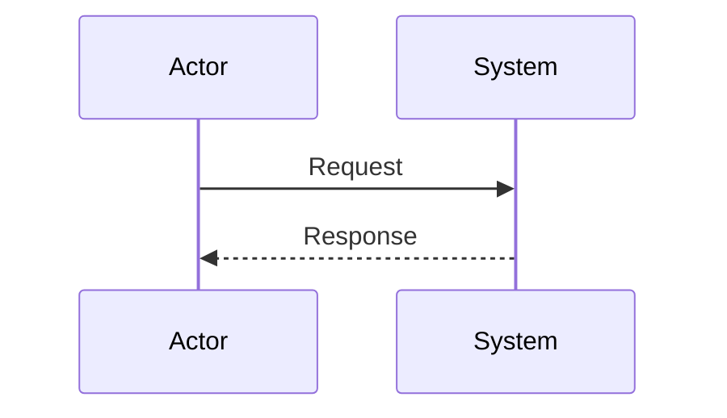
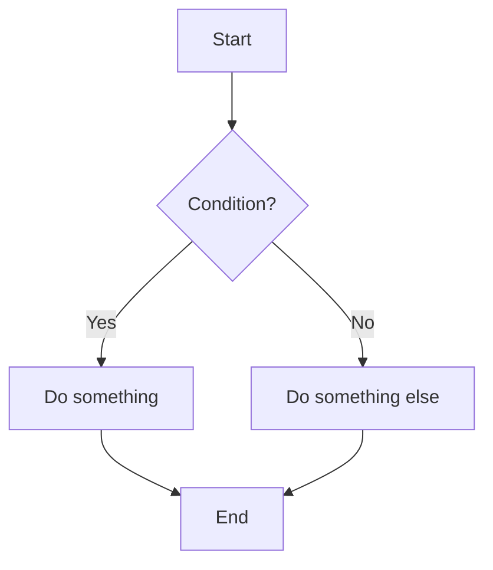
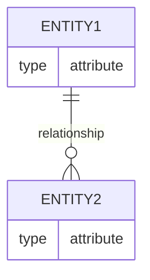
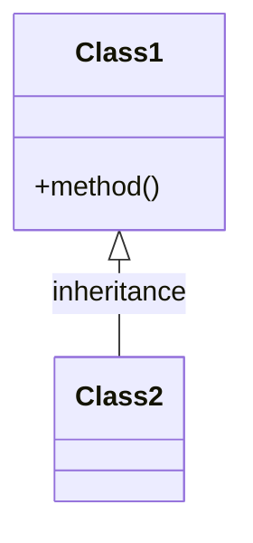

<skill name="diagram" description="Create and edit diagrams using Mermaid syntax for software documentation, architecture visualization, and system modeling. Use when users need to diagram, visualize, model, map out, or show flows of systems, processes, or architectures.">

# Diagram Creation with Mermaid

Create professional software diagrams using Mermaid's text-based syntax. Use when requested to create, visualize, or document software through diagrams.

## Quick Reference

| Task | Guide |
|------|-------|
| Detailed syntax patterns for all diagram types | Read [references/syntax-patterns.md](references/syntax-patterns.md) |
| Best practices and troubleshooting guidance | Read [references/best-practices.md](references/best-practices.md) |
| Complex architecture and multi-diagram approaches | Read [references/complex-architectures.md](references/complex-architectures.md) |
| Detailed examples for different scenarios | Read [references/examples.md](references/examples.md) |

## When to Use

Trigger this skill when users ask to:
- "diagram" a system or process
- "visualize" a flow or architecture
- "model" a domain or system
- "map out" a process or workflow
- "show the flow" of an application or system
- Explain system architecture, database design, code structure, or user/application flows

## Diagram Type Selection Guide

Match user requests to appropriate diagram types:

| Request Pattern | Recommended Diagram Type | Use When |
|----------------|-------------------------|----------|
| Authentication flows, API interactions, message passing | Sequence Diagram | Showing temporal interactions between actors/systems |
| User journeys, business processes, algorithms | Flowchart | Visualizing decision paths, workflows, or processes |
| Database schemas, table relationships | Entity Relationship Diagram (ERD) | Modeling data structures and their relationships |
| System components, architecture levels | C4 Diagram | Depicting software architecture at different abstraction levels |
| Class structures, object relationships | Class Diagram | Modeling object-oriented designs and relationships |
| Status transitions, lifecycle states | State Diagram | Showing how objects change states in response to events |
| Project timelines, scheduling | Gantt Chart | Visualizing project schedules and task dependencies |
| Version control history | Git Graph | Illustrating branching and merging in version control |
| Data distribution, proportions | Pie/Bar Chart | Displaying quantitative data distributions |
| Complex multi-system architectures | Multiple Diagrams | Breaking down complex systems into manageable views |

## Core Workflow

1. **Analyze Request** - Identify key entities, relationships, and flow
2. **Select Diagram Type** - Match to the selection guide above
3. **Create Minimal Diagram** - Start with essential elements
4. **Add Details** - Include relationships and annotations
5. **Validate Output** - Check syntax and completeness

## Minimal Complete Examples

### Sequence Diagram

### Flowchart

### Entity Relationship Diagram

### Class Diagram

## When to Read References

- For detailed syntax patterns beyond the basics shown above
- For complex diagram scenarios requiring advanced features
- For best practices on handling large or intricate diagrams
- For guidance on multi-diagram architectural documentation
- For troubleshooting specific diagram issues

Refer to the Quick Reference section above to find the appropriate reference document for your specific needs.

</skill>