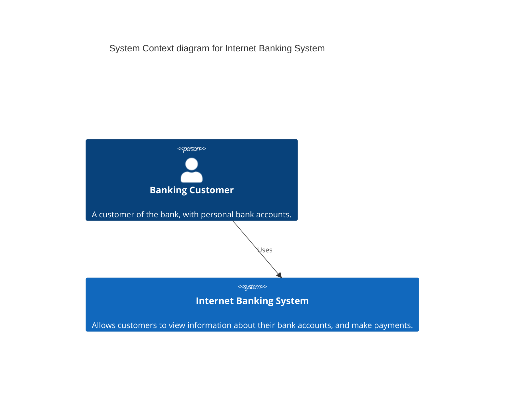
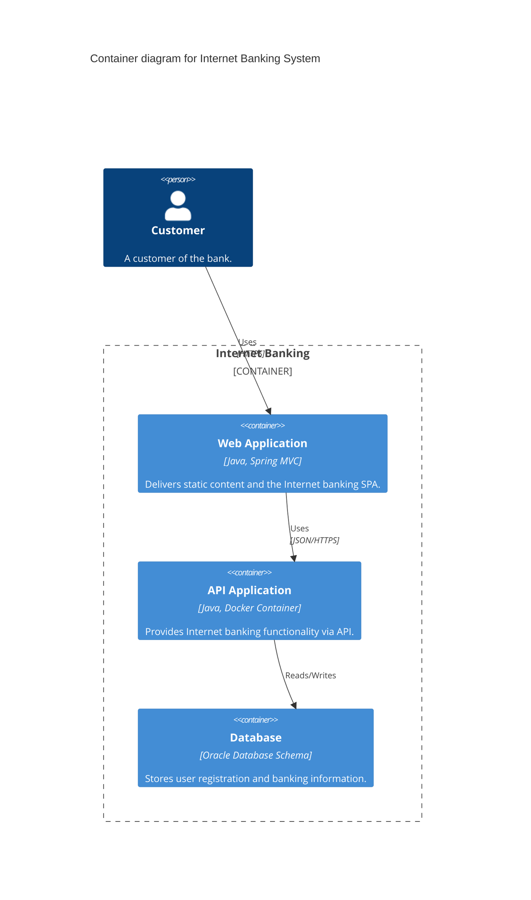
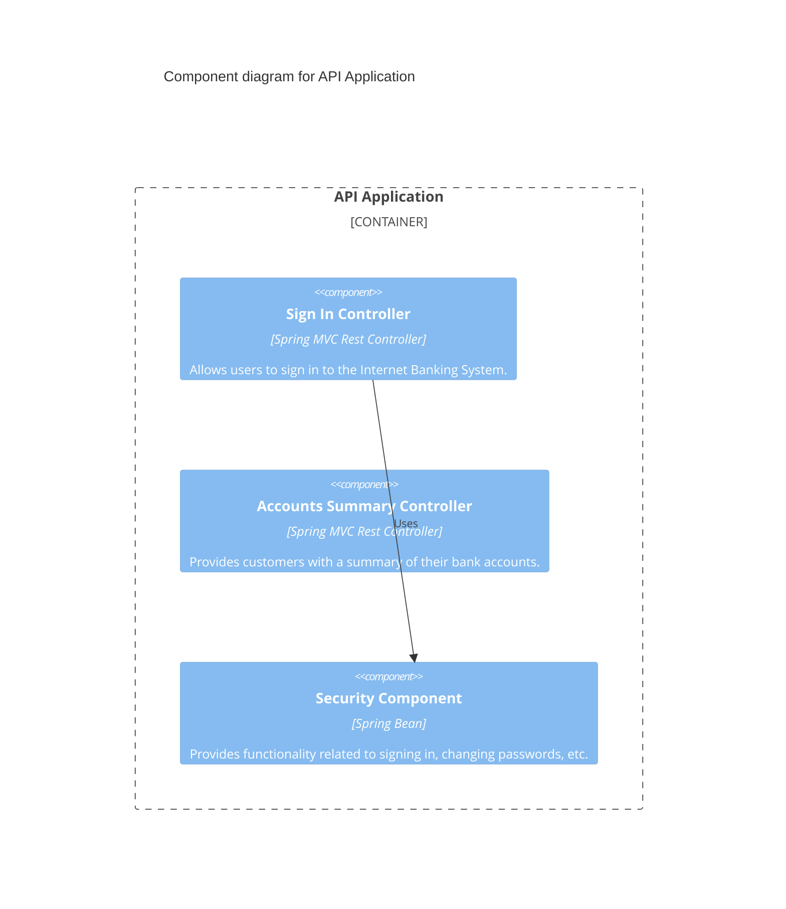
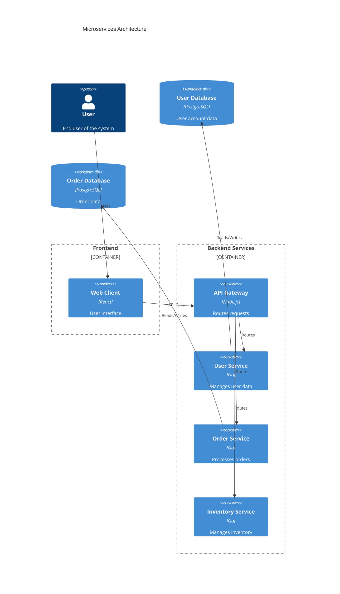

# Complex Architectures and Multi-Diagram Approaches

Guidance for handling sophisticated system architectures that require advanced diagramming techniques.

## C4 Model Approach

The C4 model provides a hierarchical approach to software architecture documentation:

### Level 1: System Context Diagram
Shows the system in scope and its relationship with users and external systems.

### Level 2: Container Diagram
Zooms into the system to show high-level technical building blocks.

### Level 3: Component Diagram
Zooms into a container to show components and their relationships.

### Level 4: Code Diagram
Optional level showing UML class diagrams for critical components.

## Multi-Diagram Documentation Strategy

### Architecture Decision Records (ADRs)
When documenting complex systems, link diagrams to ADRs:

1. **Context Diagram** - Shows the problem space
2. **Solution Options** - Multiple diagrams comparing alternatives
3. **Selected Solution** - Final architecture diagram
4. **Implementation Views** - Detailed technical diagrams

### Viewpoints and Perspectives
Different stakeholders need different views:

#### Functional View
Focus on what the system does:
- Use case diagrams
- Activity diagrams
- Sequence diagrams for key flows

#### Information View
Focus on data structures and relationships:
- Entity relationship diagrams
- Data flow diagrams
- Class diagrams

#### Concurrency View
Focus on system behavior over time:
- State machine diagrams
- Sequence diagrams with timing
- Activity diagrams with parallel flows

#### Development View
Focus on code organization:
- Package diagrams
- Component diagrams
- Module dependency diagrams

#### Physical View
Focus on deployment topology:
- Deployment diagrams
- Network topology diagrams
- Infrastructure diagrams

## Handling Distributed Systems

### Microservices Architecture
For microservices, show:

1. **High-Level Context** - Service boundaries and external dependencies
2. **Service Interactions** - API contracts and communication patterns
3. **Data Flow** - How data moves between services
4. **Deployment Topology** - Where services run and scale

Example approach:

### Event-Driven Architecture
Show event flows and processing:

1. **Event Sources** - Where events originate
2. **Event Channels** - How events are transported
3. **Event Processors** - How events are handled
4. **Event Sinks** - Where events end up

### Data Pipeline Architecture
For data-intensive systems:

1. **Ingestion Layer** - How data enters the system
2. **Processing Layer** - How data is transformed
3. **Storage Layer** - Where data is stored
4. **Consumption Layer** - How data is used

## Cross-System Integration

### API Integration Diagrams
Show how systems communicate:

1. **Protocol Details** - HTTP, gRPC, message queues
2. **Data Formats** - JSON, Protocol Buffers, Avro
3. **Authentication** - OAuth, API keys, certificates
4. **Error Handling** - Retry logic, circuit breakers

### Data Integration Diagrams
Show how data flows between systems:

1. **ETL Processes** - Extract, Transform, Load flows
2. **Real-time Sync** - Streaming data synchronization
3. **Batch Processing** - Scheduled data processing
4. **Data Governance** - Lineage and quality controls

## Scaling and Performance Considerations

### Horizontal Scaling
Show load balancing and scaling patterns:

1. **Load Distribution** - How traffic is spread
2. **Auto-scaling** - When and how components scale
3. **State Management** - How state is handled across instances
4. **Failure Handling** - How the system handles component failures

### Caching Strategies
Illustrate cache layers and invalidation:

1. **Cache Locations** - Where caches exist in the architecture
2. **Cache Hierarchies** - Multi-level caching approaches
3. **Invalidation Patterns** - How cached data is refreshed
4. **Consistency Models** - Trade-offs between consistency and performance

## Security Architecture

### Threat Modeling Diagrams
Show security boundaries and controls:

1. **Trust Boundaries** - Where security contexts change
2. **Data Classification** - How data is categorized and protected
3. **Access Controls** - How authorization is enforced
4. **Audit Trails** - How activities are logged and monitored

### Compliance Diagrams
Show adherence to regulations:

1. **Data Residency** - Where data is stored geographically
2. **Privacy Controls** - How personal data is protected
3. **Audit Requirements** - What needs to be tracked for compliance
4. **Retention Policies** - How long data is kept

## Documentation Organization

### Diagram Catalog
Maintain an inventory of all diagrams:

1. **Purpose** - What each diagram shows
2. **Audience** - Who each diagram is for
3. **Dependencies** - How diagrams relate to each other
4. **Status** - Current, deprecated, draft

### Navigation Aids
Help users find relevant diagrams:

1. **Master Index** - Central catalog of all diagrams
2. **Cross-References** - Links between related diagrams
3. **Search Tags** - Keywords for finding diagrams
4. **Version History** - How diagrams have evolved

### Update Management
Keep diagrams current with the system:

1. **Change Triggers** - When diagrams need updates
2. **Review Cycles** - Regular validation of accuracy
3. **Ownership** - Who maintains each diagram
4. **Tooling** - Automated checks and updates