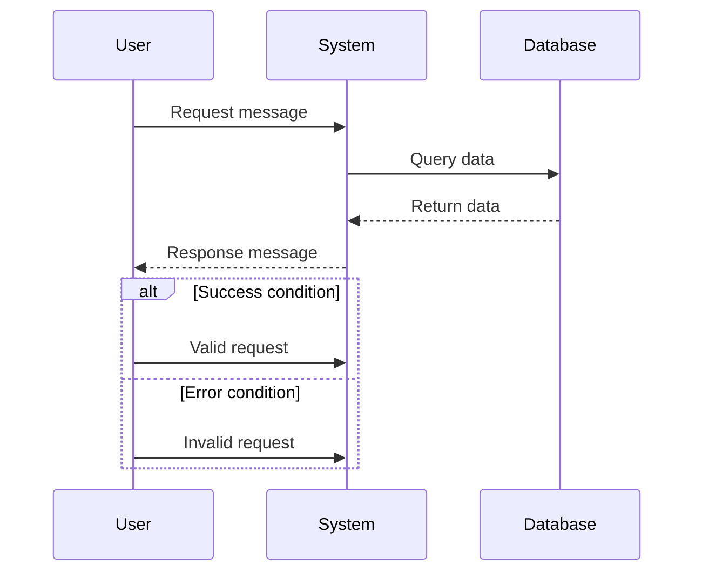
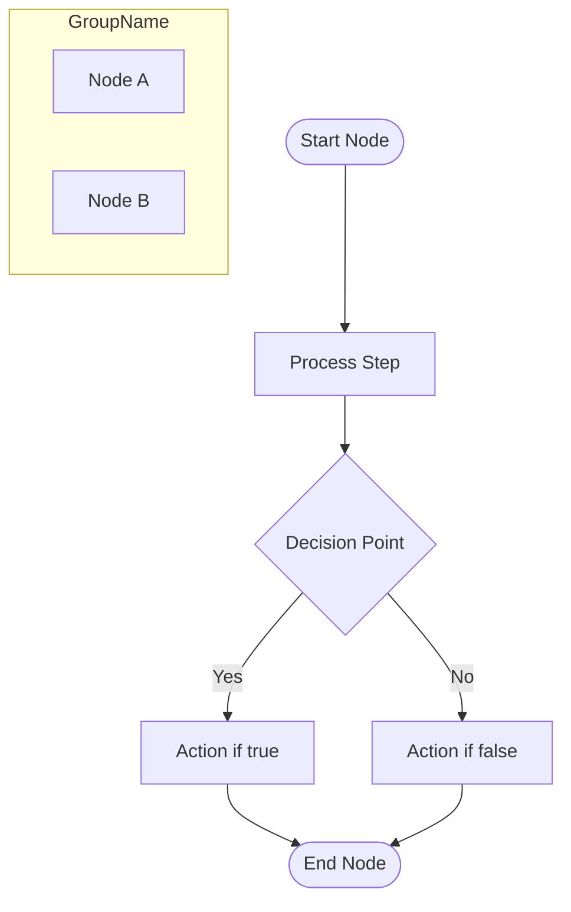
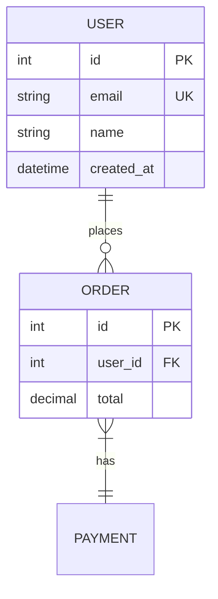
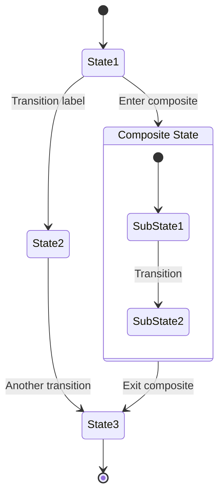
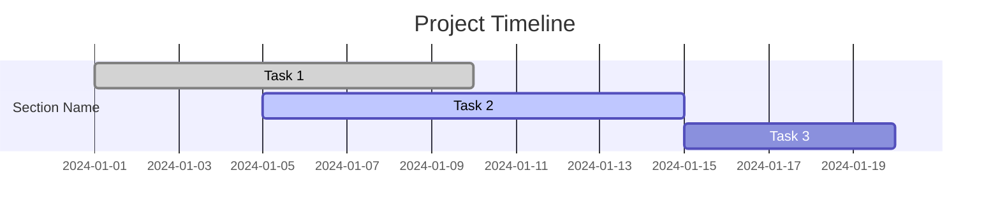
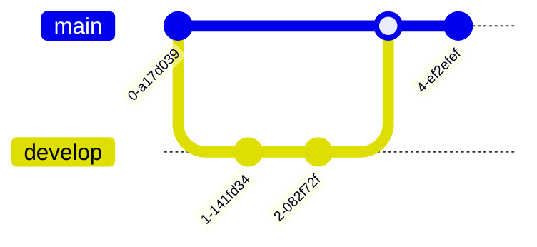

# Diagram Syntax Patterns

Detailed Mermaid syntax patterns for all supported diagram types.

## Sequence Diagram



Key syntax elements:
- `->>` Solid arrow (synchronous call)
- `-->>` Dotted arrow (response/return)
- `participant` Named actors/components
- `alt/else/end` Alternative flows
- `opt/end` Optional flows
- `loop/end` Loop constructs

## Flowchart



Key syntax elements:
- `TD` Top-down direction (also `LR` for left-right)
- `[Text]` Rectangles
- `(Text)` Rounded rectangles
- `{Text}` Diamonds (decisions)
- `[Text]` Circles (start/end)
- `-->` Arrows with optional labels `-->|label|`
- `subgraph` Group related elements

## Entity Relationship Diagram



Key syntax elements:
- Entity names in caps
- Attributes with types and keys
- `PK` Primary key, `FK` Foreign key, `UK` Unique key
- Relationship lines with cardinality markers
- Relationship labels in quotes

## Class Diagram

```mermaid
classDiagram
    %% Class definition
    class ClassName {
        -privateAttribute: Type
        +publicAttribute: Type
        ~protectedMethod(): ReturnType
        +publicMethod(param: Type): ReturnType
    }
    
    %% Relationships
    Parent <|-- Child : inheritance
    Class1 --> Class2 : association
    Class1 --* Class2 : composition
    Class1 --o Class2 : aggregation
    Class1 ..|> Class2 : realization
    Class1 .. Class2 : dependency
    
    %% Annotations
    <<interface>> InterfaceName
    <<abstract>> AbstractClass
```

Key syntax elements:
- Visibility: `-` private, `+` public, `~` protected, `#` package
- Relationship arrows: `<|--` inheritance, `-->` association, etc.
- Annotations: `<<interface>>`, `<<abstract>>`
- Method parameters and return types

## C4 Component Diagram

```mermaid
C4Component
    title Component diagram for System
    
    %% People (external actors)
    Person(personAlias, "Person Label", "Person Description")
    
    %% System boundaries
    System_Boundary(systemAlias, "System Boundary Label") {
        %% Containers within system
        Container(containerAlias, "Container Label", "Technology", "Container Description")
    }
    
    %% Container boundaries
    Container_Boundary(boundaryAlias, "Boundary Label") {
        %% Components within container
        Component(componentAlias, "Component Label", "Technology", "Component Description")
    }
    
    %% External systems
    System_Ext(extSystemAlias, "External System Label", "External System Description")
    
    %% Databases
    ContainerDb(dbAlias, "Database Label", "Technology", "Database Description")
    
    %% Relationships
    personAlias --> containerAlias : "Relationship Label"  
```

Key syntax elements:
- `Person` External actors/users
- `System_Boundary` Top-level system boundaries
- `Container` Applications/services
- `Container_Boundary` Grouping containers
- `Component` Internal components/modules
- `System_Ext` External systems
- `ContainerDb` Databases
- Relationships with labels

## State Diagram



## Gantt Chart



## Git Graph



## Pie/Bar Charts

