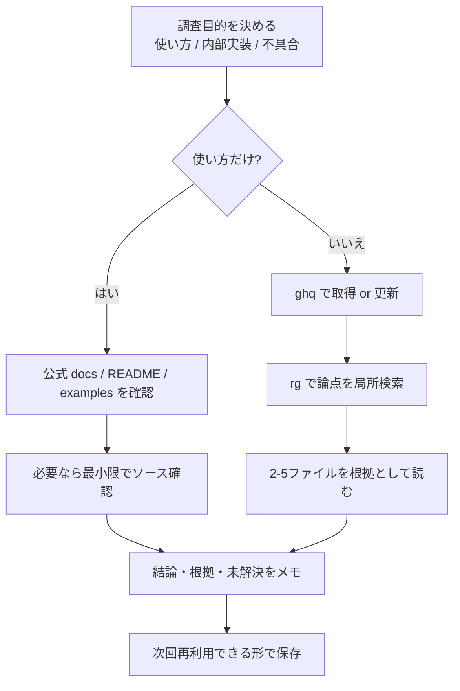

# ghq でリポジトリ調査・分析する実践ガイド

このガイドは、`ghq` を使って外部リポジトリを素早く調査し、再現可能な形で分析結果を残すための手順をまとめたもの。

## 1. まず押さえる方針

- 先に「何を知りたいか」を決める（使い方 / 内部実装 / 両方）
- 使い方だけなら公式ドキュメントを先に読む
- 内部挙動やバグ調査ならソースを読む
- ソースを読むときは、全体読破ではなく `rg` で局所化して読む
- 最後に調査メモを残す（結論・根拠・未解決）

## 2. 調査フロー図



## 3. 初回セットアップと前提確認

```bash
#!/usr/bin/env bash
set -eu

command -v ghq >/dev/null
command -v rg >/dev/null
command -v git >/dev/null

ghq root
```

### 推奨ルール

- すべての調査対象を `ghq root` 配下に集約する
- 以降のコマンドは `REPO="$(ghq root)/github.com/<owner>/<repo>"` を基準にする
- 環境差で相対パスが崩れないよう、絶対パス前提で扱う

## 4. 調査の標準フロー（そのまま使える）

### Step 1: 取得・更新

```bash
#!/usr/bin/env bash
set -eu

TARGET="github.com/honojs/hono"
REPO="$(ghq root)/${TARGET}"

if [ -d "${REPO}/.git" ]; then
  git -C "${REPO}" fetch --all --prune
  git -C "${REPO}" pull --ff-only
else
  ghq get "${TARGET}"
fi
```

### Step 2: 全体把握（1-3分）

```bash
#!/usr/bin/env bash
set -eu

REPO="$(ghq root)/github.com/honojs/hono"

ls "${REPO}"
rg --files "${REPO}" | rg "README|docs|examples|src|test"
```

チェック観点:

- エントリーポイント（例: `src/index.*`）
- ドキュメントの中心（`README.md`, `docs/`）
- 実装とテストの対応（`src/` と `test/`）

### Step 3: 論点別に局所検索

```bash
#!/usr/bin/env bash
set -eu

REPO="$(ghq root)/github.com/honojs/hono"

rg "bearerAuth|jwt|middleware" "${REPO}/src" "${REPO}/docs" "${REPO}/examples"
```

コツ:

- 「機能名 + 関連語」を OR 検索する（例: `cache|ttl|evict`）
- まず `docs` と `examples`、次に `src`、最後に `test` を読む
- マッチ件数が多いときは `rg "pattern" <dir> | head` ではなく、検索語を絞る

### Step 4: 根拠ファイルを最小限読む

目安は 2-5 ファイル:

1. 公開 API の定義ファイル
2. 実装の中核ファイル
3. テストファイル（仕様の事実確認）
4. 必要ならサンプル実装

## 5. 目的別の進め方

### A. 使い方を知りたい（API 利用調査）

1. 公式 docs / README を確認
2. examples を確認
3. 実装はシグネチャだけ確認
4. 「最小コード例」を手元メモに残す

### B. 内部挙動を知りたい（実装調査）

1. docs で仕様の期待値を確認
2. `src` を `rg` で絞って読む
3. `test` で実際の挙動を確認
4. 仕様と実装の差分を記録

### C. 不具合調査

1. 再現条件を1行で固定
2. その条件に関係するキーワードで `rg`
3. 条件分岐とエラーハンドリング箇所を確認
4. テスト追加可能性まで確認

## 6. 調査メモのテンプレート

`docs/research/<date>-<topic>.md` を作る:

```md
# Research: <topic>

## Question
- 何を知りたいか:

## Conclusion
- 結論:

## Evidence
- <repo path>: <file path>
- <repo path>: <file path>

## Notes
- 前提:
- バージョン:
- 未解決:
```

最低限、以下を残す:

- 結論（1-3行）
- 根拠ファイル（2件以上）
- 未解決事項（あれば）

## 7. 実務で効くベストプラクティス

### 7.1 速度最適化

- まず docs、次に source（いきなり深掘りしない）
- `rg` の対象ディレクトリを必ず絞る
- 1セッション1論点で進める（認証、キャッシュ、ルーティングを混ぜない）

### 7.2 精度最適化

- docs の主張は test で裏取りする
- 「動く例」は `examples` から取る
- 実装依存の判断は、対象バージョンを明記する

### 7.3 再現性

- `ghq root` + 絶対パスでメモを書く
- 調査コマンドをメモに残す
- 結論に「どのファイルで確認したか」を必ず添える

## 8. よくある失敗と回避策

- 失敗: README だけ読んで終わる
  - 回避: `src` と `test` から最低1ファイルずつ確認
- 失敗: 検索語が広すぎる
  - 回避: ドメイン語で絞る（例: `session`, `token`, `refresh`）
- 失敗: 調査メモを残さない
  - 回避: テンプレートを先に作ってから調査する

## 9. コマンドスニペット集

### 9.1 管理対象一覧

```bash
ghq list
```

### 9.2 特定 org だけ絞る

```bash
ghq list | rg "^github.com/honojs/"
```

### 9.3 複数リポジトリ横断検索

```bash
ROOT="$(ghq root)"
rg "OpenAPI|swagger" "${ROOT}/github.com/org1/repo1" "${ROOT}/github.com/org2/repo2"
```

### 9.4 調査開始用テンプレ（コピペ用）

```bash
#!/usr/bin/env bash
set -eu

command -v ghq >/dev/null
command -v rg >/dev/null

TARGET="github.com/<owner>/<repo>"
REPO="$(ghq root)/${TARGET}"

if [ -d "${REPO}/.git" ]; then
  git -C "${REPO}" fetch --all --prune
else
  ghq get "${TARGET}"
fi

rg "TODO: replace-this-pattern" "${REPO}/docs" "${REPO}/src" "${REPO}/test"
```
